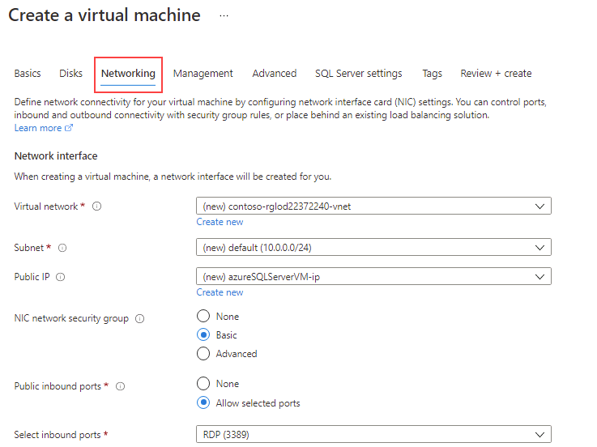

---
lab:
  title: 랩 1 - Azure 가상 머신에서 SQL Server 프로비저닝
  module: Plan and Implement Data Platform Resources
---

# Azure 가상 머신에서 SQL Server 프로비저닝

**예상 시간:** 30분

학생은 Azure Portal을 탐색하고 이를 사용하여 설치된 SQL Server 2019에서 Azure VM을 만듭니다. 그런 다음 원격 데스크톱 프로토콜을 통해 가상 머신에 연결합니다.

AdventureWorks의 데이터베이스 관리자입니다. 개념 증명에서 사용할 테스트 환경을 만들어야 합니다. 개념 증명은 Azure Virtual Machine의 SQL Server 및 AdventureWorksDW 데이터베이스의 백업을 사용합니다. Virtual Machine을 설정하고 데이터베이스를 복원하고 쿼리하여 사용할 수 있는지 확인해야 합니다.

## Azure VM(가상 머신)에서 SQL Server 배포

1. 랩 가상 머신에서 브라우저 세션을 시작하고 [https://portal.azure.com](https://portal.azure.com/)으로 이동하여 Azure 구독과 연결된 Microsoft 계정을 사용하여 로그인합니다.

    

1. 페이지 맨 위에 있는 검색 창을 찾습니다. **Azure SQL**을 검색합니다. 결과에서 **서비스** 아래에 표시되는 **Azure SQL**의 검색 결과를 선택합니다.

    

1. **Azure SQL** 블레이드에서 **만들기**를 선택합니다.

    

1. **SQL 배포 옵션 선택** 블레이드에서 **SQL 가상 머신** 아래에 있는 드롭다운 상자를 클릭합니다. **무료 SQL Server 라이선스: Windows Server 2022의 SQL 2019 Developer** 레이블이 지정된 옵션을 선택합니다. 다음으로 **만들기**를 선택합니다.

    

1. **가상 머신 만들기** 페이지에서 다음 정보를 입력합니다.

    - **구독**: &lt;사용자의 구독&gt;
    - **리소스 그룹:** &lt;리소스 그룹&gt;
    - **가상 머신 이름:**  azureSQLServerVM
    - **지역:** &lt;사용자 리소스 그룹의 선택한 지역과 동일한 사용자 지역&gt;
    - **가용성 옵션:** 인프라 중복 필요 없음
    - **이미지:** 무료 SQL Server 라이선스: Windows Server 2022의 SQL 2019 Developer - 1세대
    - **Azure 스폿 인스턴스:** 아니요(선택 취소됨)
    - **크기:** 표준 *D2s_v3*(2개의 vCPUs, 8GiB 메모리) 이 옵션을 보려면 “모든 크기 보기” 링크를 선택해야 할 수 있습니다.
    - **관리자 계정 사용자 이름:** sqladmin
    - **관리자 계정 암호:** pwd!DP300lab01(또는 기준을 충족하는 사용자 고유의 암호)
    - **인바운드 포트 선택:** RDP(3389)
    - **기존 Windows Server 라이선스를 사용하시겠어요?:** 아니요(선택 취소됨)

    나중에 사용할 수 있도록 사용자 이름 및 암호를 적어 둡니다.

    

1. **디스크** 탭으로 이동하여 구성을 검토합니다.

    

1. **네트워킹** 탭으로 이동하여 구성을 검토합니다.

    

1. **관리** 탭으로 이동하여 구성을 검토합니다.

    

    **auto_shutdown 사용**이 선택 취소되어 있는지 확인합니다.

1. **고급** 탭으로 이동하여 구성을 검토합니다.

    

1. **SQL Server 설정** 탭으로 이동하여 구성을 검토합니다.

    

    **참고 -** 이 화면에서 SQL Server VM용 스토리지를 구성할 수도 있습니다. 기본적으로 SQL Server Azure VM 템플릿은 데이터에 대한 읽기 캐싱이 있는 프리미엄 디스크 1개와 트랜잭션 로그에 대한 캐싱이 없는 프리미엄 디스크 1개를 만들고 tempdb에 대한 로컬 SSD(Windows의 D:\)를 사용합니다.

1. **검토 + 만들기** 단추를 선택합니다. 다음으로 **만들기**를 선택합니다.

    

1. 배포 블레이드에서 배포가 완료될 때까지 기다립니다. VM을 배포하는 데 약 5~10분이 소요됩니다. 배포가 완료되면 **리소스로 이동**을 선택합니다.

    **참고:** 배포를 완료하는 데 몇 분 정도 걸릴 수 있습니다.

    

1. 가상 머신의 **개요** 페이지에서 리소스의 메뉴 옵션을 탐색하여 사용할 수 있는 옵션을 검토합니다.

    

## Azure VM(가상 머신)에서 SQL Server에 연결

1. 가상 머신의 **개요** 페이지에서 **연결**을 선택합니다.

1. 연결 창에서 **RDP 파일 다운로드**를 선택합니다.

    

    **참고:** **포트 필수 구성 요소가 충족되지 않음** 오류가 표시되는 경우 *포트 번호* 필드에 언급된 대상 포트를 사용하여 인바운드 네트워크 보안 그룹 규칙을 추가할 링크를 선택해야 합니다.

    

1. 방금 다운로드한 RDP 파일을 엽니다. 연결할지 묻는 대화 상자가 나타나면 **연결**을 선택합니다.

    

1. 가상 머신 프로비전 프로세스 중에 선택한 사용자 이름과 암호를 입력합니다. 그런 다음 **확인**을 선택합니다.

    

1. 연결할지 묻는 **원격 데스크톱 연결** 대화 상자가 나타나는 경우 **예**를 선택합니다.

    

1. Windows 시작 단추를 선택하고 SSMS를 입력합니다. 목록에서 **Microsoft SQL Server Management Studio**를 선택합니다.  

1. SSMS가 열리면 **서버에 연결** 대화 상자가 기본 인스턴스 이름으로 미리 채워집니다. **서버 인증서 신뢰** 옵션을 선택한 다음 **연결**을 선택합니다.

    

Azure Portal은 가상 머신에서 호스트되는 SQL Server를 관리할 수 있는 강력한 도구를 제공합니다. 해당 도구에는 자동화된 패치 제어, 자동화된 백업, 고가용성을 설정하는 간편한 방법 제공 등이 포함됩니다.
