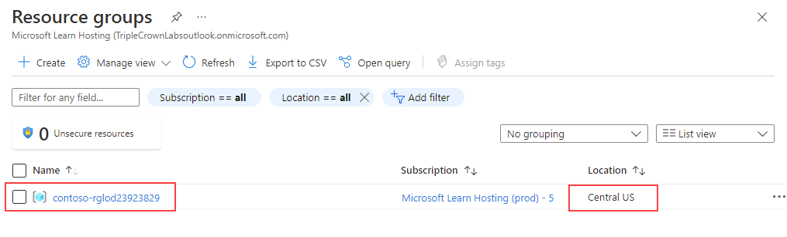
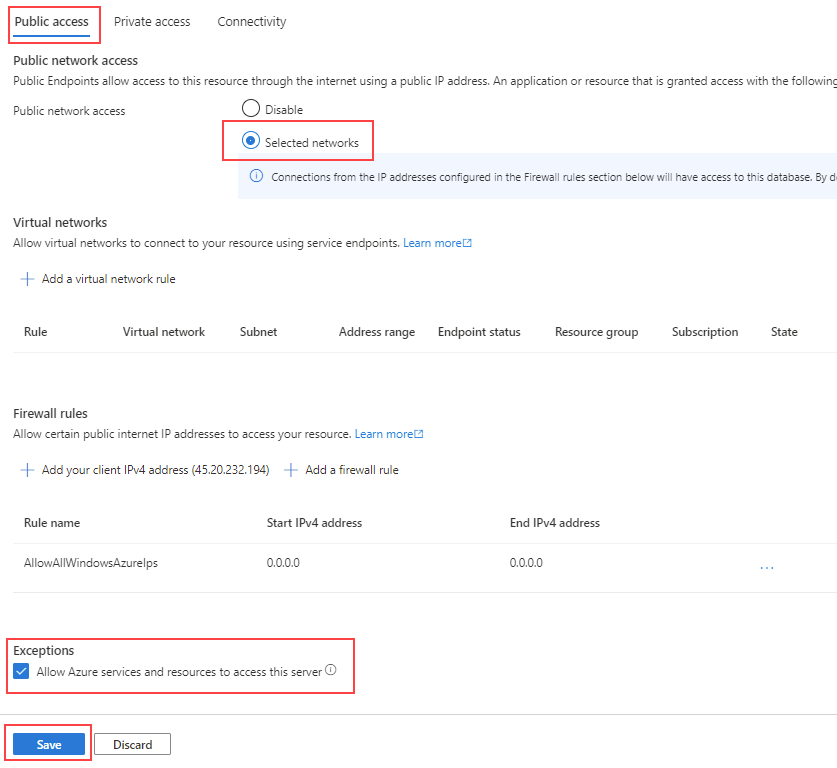
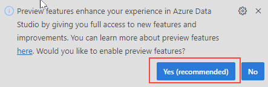
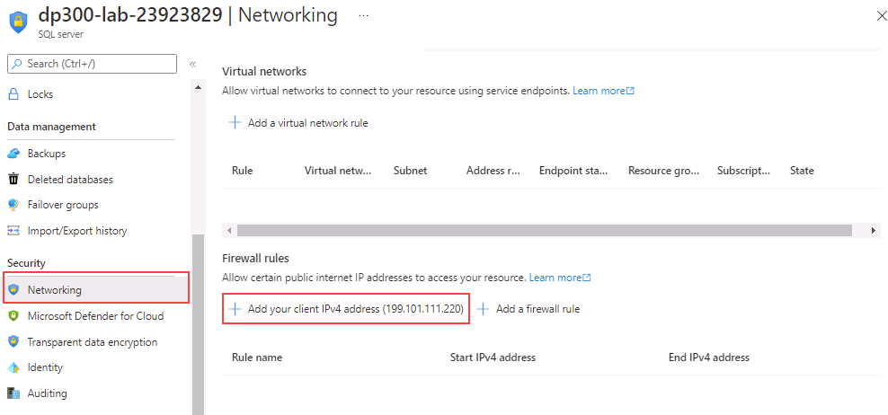
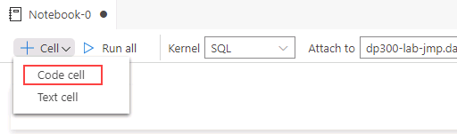

---
lab:
  title: 랩 2 - Azure SQL Database 프로비저닝
  module: Plan and Implement Data Platform Resources
---

# Azure SQL Database 프로비전

**예상 시간: 40분**

학생들은 가상 네트워크 엔드포인트를 사용하여 Azure SQL Database를 배포하는 데 필요한 기본 리소스를 구성합니다. SQL Database에 대한 연결은 랩 VM의 Azure Data Studio를 사용하여 유효성을 검사합니다.

AdventureWorks의 데이터베이스 관리자로서 배포 보안을 늘리고 단순화하기 위해 가상 네트워크 엔드포인트를 포함하는 새 SQL Database를 설정합니다. Azure Data Studio는 데이터 쿼리 및 결과 보존을 위해 SQL Notebook의 사용을 평가하는 데 사용됩니다.

## Azure Portal에서 탐색

1. 랩 가상 머신에서 브라우저 세션을 시작하고 [https://portal.azure.com](https://portal.azure.com/)으로 이동합니다. 이 랩 가상 머신의 **리소스** 탭에 제공된 Azure **사용자 이름** 및 **암호**를 사용하여 포털에 연결합니다.

    

1. Azure Portal의 맨 위에 있는 검색 상자에서 “리소스 그룹”을 검색한 다음, 옵션 목록에서 **리소스 그룹**을 선택합니다.

    

1. **리소스 그룹** 페이지에서 나열된 리소스 그룹(*contoso-rg*로 시작해야 함)을 확인하고 다음 연습에서 사용할 리소스 그룹에 할당된 **위치**를 기록해 둡니다.

    **참고:** 다른 위치가 할당되어 있을 수 있습니다.

    

## Virtual Network 만들기

1. Azure Portal 홈페이지에서 왼쪽 메뉴를 선택합니다.  

    

1. 왼쪽 탐색 창에서 **가상 네트워크**를 클릭합니다.  

1. **+ 만들기**를 클릭하여 **가상 네트워크 만들기** 페이지를 엽니다. **기본** 탭에서 다음 작업을 완료합니다.

    - **구독**: &lt;사용자의 구독&gt;
    - **리소스 그룹:** *contoso-rg*로 시작
    - **이름:** lab02-vnet
    - **지역:** 리소스 그룹이 만들어진 지역과 동일한 지역 선택

1. **검토 + 만들기**를 클릭하고 새 가상 네트워크에 대한 설정을 검토한 다음 **만들기**를 클릭합니다.

## Azure SQL Database 프로비전

1. Azure Portal의 맨 위에 있는 검색 상자에서 “SQL 데이터베이스”를 검색한 다음, 옵션 목록에서 **SQL 데이터베이스**를 클릭합니다.

    

1. **SQL 데이터베이스** 블레이드에서 **+ 만들기**를 선택합니다.

    

1. **SQL Database 만들기** 페이지의 **기본** 탭에서 다음 옵션을 선택하고 **다음: 네트워킹**을 클릭합니다.

    - **구독**: &lt;사용자의 구독&gt;
    - **리소스 그룹:** *contoso-rg*로 시작
    - **데이터베이스 이름:** AdventureWorksLT
    - **서버:** **새 링크 만들기**를 클릭합니다. **SQL Database 서버 만들기** 페이지가 열립니다. 다음과 같은 서버 세부 정보를 제공합니다.
        - **서버 이름:** dp300-lab-&lt;사용자 이니셜(소문자)&gt;(서버 이름은 전역적으로 고유해야 함)
        - **위치:** &lt;사용자 리소스 그룹의 선택한 지역과 동일한 사용자 지역, 동일하지 않으면 실패할 수 있음&gt;
        - **인증 방법**: SQL 인증 사용
        - **서버 관리자 로그인:** dp300admin
        - **암호:** dp300P@ssword!
        - **암호 확인:** dp300P@ssword!

        **SQL Database 서버 만들기** 페이지는 아래 페이지와 유사합니다. 그런 후 **OK**를 클릭합니다.

        

    -  **SQL Database 만들기** 페이지에서 **탄력적 풀 사용**이 **아니요**로 설정되어 있는지 확인합니다.
    -  **컴퓨팅 + 스토리지** 옵션에서 **데이터베이스 구성** 링크를 클릭합니다. **구성** 페이지의 **서비스 계층** 드롭다운에서 **기본**을 선택한 다음 **적용**을 선택합니다.

    **참고:** 이 서버 이름과 로그인 정보를 기록합니다. 이는 다음 랩에서 사용합니다.

1. **백업 스토리지 중복** 옵션의 경우 기본값인 **지역 중복 백업 스토리지**를 유지합니다.

1. 그런 다음 **다음: 네트워킹**을 클릭합니다.

1. **네트워킹** 탭의 **네트워크 연결** 옵션에서 **프라이빗 엔드포인트** 라디오 단추를 클릭합니다.

    

1. 그런 다음 **프라이빗 엔드포인트** 옵션에서 **+ 프라이빗 엔드포인트 추가** 링크를 클릭합니다.

    

1. 다음과 같이 **프라이빗 엔드포인트 만들기** 오른쪽 창을 완료합니다.

    - **구독**: &lt;사용자의 구독&gt;
    - **리소스 그룹:** *contoso-rg*로 시작
    - **위치:** &lt;사용자 리소스 그룹의 선택한 지역과 동일한 사용자 지역, 동일하지 않으면 실패할 수 있음&gt;
    - **이름:** DP-300-SQL-Endpoint
    - **대상 하위 리소스:** SqlServer
    - **가상 네트워크:** lab02-vnet
    - **서브넷:** lab02-vnet/default(10.x.0.0/24)
    - **프라이빗 DNS 영역과 통합:** 예
    - **프라이빗 DNS 영역:** 기본값 유지
    - 설정을 검토한 다음 **확인**을 클릭합니다.  

    

1. 새 엔드포인트가 **프라이빗 엔드포인트** 목록에 표시됩니다.

    

1. **다음: 보안**을 클릭한 다음, **다음: 추가 설정**을 클릭합니다.  

1. **추가 설정** 페이지의 **기존 데이터 사용** 옵션에서 **샘플**을 선택합니다. 샘플 데이터베이스의 팝업 메시지가 표시되면 **확인**을 선택합니다.

    

1. **검토 + 만들기**를 클릭합니다.

1. 설정을 검토하고 **만들기**를 클릭합니다.

1. 배포가 완료되면 **리소스로 이동**을 클릭합니다.

## Azure SQL Database에 대한 액세스 사용

1. **SQL 데이터베이스** 페이지에서 **개요** 섹션을 선택한 다음, 상단 섹션에서 서버 이름의 링크를 선택합니다.

    

1. SQL 서버 탐색 블레이드의 **보안** 섹션에서 **네트워킹**을 선택합니다.

    

1. **퍼블릭 액세스** 탭에서 **선택한 네트워크**를 선택한 다음, **Azure 서비스 및 리소스가 이 서버에 액세스할 수 있도록 허용** 속성을 선택합니다. **저장**을 클릭합니다.

    

## Azure Data Studio의 Azure SQL Database에 연결

1. 랩 가상 머신에서 Azure Data Studio를 실행합니다.

    - Azure Data Studio의 초기 실행 시 이 팝업이 표시될 수 있습니다. 팝업이 표시되면 **예(추천)** 를 클릭합니다.  

        

1. Azure Data Studio가 열리면 왼쪽 위 모서리에 있는 **연결** 단추를 클릭한 다음 **연결 추가**를 클릭합니다.

    

1. **연결** 사이드바에서 **연결 세부 정보** 섹션에 연결 정보를 입력하여 이전에 만든 SQL 데이터베이스에 연결합니다.

    - 연결 형식: **Microsoft SQL Server**
    - 서버: 이전에 만든 SQL Server 이름을 입력합니다. 예: **dp300-lab-xxxxxxxx.database.windows.net**(여기서 ‘xxxxxxxx’는 난수임)
    - 인증 유형: **SQL 로그인**
    - 사용자 이름: **dp300admin**
    - 암호: **dp300P@ssword!**
    - 데이터베이스 드롭다운을 펼쳐 **AdventureWorksLT**를 선택합니다. 
        - **참고:** 클라이언트 IP가 이 서버에 액세스할 수 있도록 허용하는 방화벽 규칙을 추가하라는 메시지가 표시될 수 있습니다. 방화벽 규칙을 추가하라는 메시지가 표시되면 **계정 추가**를 클릭하고 Azure 계정에 로그인합니다. **새 방화벽 규칙 만들기** 화면에서 **확인**을 클릭합니다.

        

        또는 SQL 서버로 이동하고 **네트워킹**을 선택한 다음, **+ 클라이언트 IPv4 주소 추가(IP 주소)** 를 선택하여 Azure Portal에서 SQL 서버의 방화벽 규칙을 수동으로 만들 수 있습니다.

        

    다시 연결 사이드바에서 다음 연결 세부 정보를 계속 작성합니다.  

    - 서버 그룹은 **&lt;기본값&gt;** 으로 남아 있습니다.
    - 원하는 경우 이름(선택 사항)을 데이터베이스의 식별 이름으로 채울 수 있습니다.
    - 설정을 검토하고 **연결**을 클릭합니다.  

    

1. Azure Data Studio는 데이터베이스에 연결하고 데이터베이스에 대한 몇 가지 기본 정보와 개체의 일부 목록을 표시합니다.

    

## SQL Notebook을 사용하여 Azure SQL Database 쿼리

1. 이 랩의 AdventureWorksLT 데이터베이스에 연결된 Azure Data Studio에서 **새 Notebook** 단추를 클릭합니다.

    

1. **+텍스트** 링크를 클릭하여 Notebook에 새 텍스트 상자를 추가합니다.  

    

**참고:** Notebook에서 쿼리 또는 결과 세트를 설명하는 일반 텍스트를 포함할 수 있습니다.

1. **Top Ten Customers by Order SubTotal** 텍스트를 입력하고 원하는 경우 굵게 표시합니다.

    

1. **+ 셀** 단추를 클릭한 다음 **코드 셀**을 클릭하여 Notebook 끝에 새 코드 셀을 추가합니다.  

    

5. 새 셀에 다음 SQL 문을 붙여넣습니다.

```sql
SELECT TOP 10 cust.[CustomerID], 
    cust.[CompanyName], 
    SUM(sohead.[SubTotal]) as OverallOrderSubTotal
FROM [SalesLT].[Customer] cust
    INNER JOIN [SalesLT].[SalesOrderHeader] sohead
         ON sohead.[CustomerID] = cust.[CustomerID]
GROUP BY cust.[CustomerID], cust.[CompanyName]
ORDER BY [OverallOrderSubTotal] DESC
   ```

1. 화살표가 있는 파란색 원을 클릭하여 쿼리를 실행합니다. 쿼리를 사용하여 셀에 결과를 포함하는 방법을 확인합니다.

1. **+ 텍스트** 단추를 클릭하여 새 텍스트 셀을 추가합니다.

1. **Top Ten Ordered Product Categories** 텍스트를 입력하고 원하는 경우 굵게 표시합니다.

1. **+ 코드** 단추를 다시 클릭하여 새 셀을 추가하고 다음 SQL 문을 셀에 붙여넣습니다.

```sql
SELECT TOP 10 cat.[Name] AS ProductCategory, 
    SUM(detail.[OrderQty]) AS OrderedQuantity
FROM salesLT.[ProductCategory] cat
   INNER JOIN [SalesLT].[Product] prod
      ON prod.[ProductCategoryID] = cat.[ProductCategoryID]
   INNER JOIN [SalesLT].[SalesOrderDetail] detail
      ON detail.[ProductID] = prod.[ProductID]
GROUP BY cat.[name]
ORDER BY [OrderedQuantity] DESC
```

1. 화살표가 있는 파란색 원을 클릭하여 쿼리를 실행합니다.

1. Notebook의 모든 셀을 실행하고 결과를 표시하려면 도구 모음에서 **모두 실행** 단추를 클릭합니다.

    

1. Azure Data Studio 내에서 파일 메뉴(다른 이름으로 저장 또는 저장)의 Notebook을 **C:\Labfiles\Deploy Azure SQL Database** 경로에 저장합니다(폴더 구조가 없는 경우 새로 만들기). 파일 확장명이 **.ipynb**인지 확인합니다.

1. Azure Data Studio 내부에서 Notebook 탭을 닫습니다. 파일 메뉴에서 파일 열기를 선택하고 방금 저장한 Notebook을 엽니다. 쿼리 결과가 Notebook의 쿼리와 함께 저장되었는지 확인합니다.

이 연습에서는 Virtual Network Endpoint를 사용하여 Azure SQL Database를 배포하는 방법을 알아보았습니다. 또한 SQL Server Management Studio를 사용하여 만든 SQL Database에 연결할 수 있었습니다.
