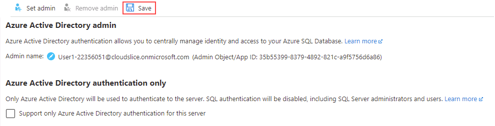
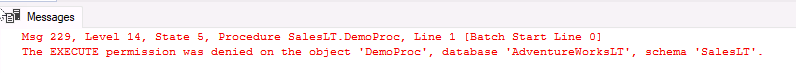

---
lab:
  title: 랩 3 - Azure Active Directory를 사용하여 Azure SQL Database에 대한 액세스 권한 부여
  module: Implement a Secure Environment for a Database Service
---

# 데이터베이스 인증 및 권한 부여 구성

**예상 소요 시간:** 20분

학생들은 단원에서 파악한 정보를 사용하여 Azure Portal 및 *AdventureWorks* 내에서 보안 기능을 구성한 후 구현합니다.

데이터베이스 환경의 보안을 유지하는 데 도움을 주는 선임 데이터베이스 관리자로 고용되었습니다.

**참고:** 이 연습을 진행할 때는 T-SQL 코드를 복사하여 붙여넣어야 합니다. 코드를 실행하기 전에 코드를 올바르게 복사했는지 확인하세요.

## Azure Active Directory를 사용하여 Azure SQL Database에 대한 액세스 권한 부여

1. 랩 가상 머신에서 브라우저 세션을 시작하고 [https://portal.azure.com](https://portal.azure.com/)으로 이동합니다. 이 랩 가상 머신의 **리소스** 탭에 제공된 Azure **사용자 이름** 및 **암호**를 사용하여 포털에 연결합니다.

    

1. Azure Portal 홈페이지에서 **모든 리소스**를 선택합니다.

    

1. Azure SQL Database 서버인 **dp300-lab-xxxxxx**를 선택합니다. 여기서 **xxxxxx**는 임의 문자열입니다. **Active Directory 관리자** 옆에 있는 **구성되지 않음**을 선택합니다.

    

1. 다음 화면에서 **관리자 설정**을 선택합니다.

    

1. **Azure Active Directory** 사이드바에서 Azure Portal에 로그인한 Azure 사용자 이름을 검색한 다음, **선택**을 클릭합니다.

1. **저장**을 선택하여 프로세스를 완료합니다. 이렇게 하면 사용자 이름이 아래와 같이 서버의 Azure Active Directory 관리자가 됩니다.

    

1. 왼쪽에서 **개요**를 선택하고 **서버 이름**을 복사합니다.

    

1. SQL Server Management Studio를 열고 **연결** > **데이터베이스 엔진**을 선택합니다. **서버 이름**에서 서버 이름을 붙여넣습니다. 인증 형식을 **Azure Active Directory 유니버설(MFA 포함)** 로 변경합니다.

    

    **사용자 이름** 필드에서 **리소스** 탭의 Azure **사용자 이름**을 선택합니다.

1. **연결**을 선택합니다.

> [!NOTE]
> Azure SQL 데이터베이스에 처음 로그인할 때 클라이언트 IP 주소를 방화벽에 추가해야 합니다. 이 작업은 SQL Server Management Studio에서 자동으로 수행할 수 있습니다. **리소스** 탭에 있는 Azure Portal **암호**를 사용하고 **로그인**을 선택한 다음, Azure 자격 증명을 선택하고 **확인**을 선택합니다.
> 

## 데이터베이스 개체에 대한 액세스 관리

이 작업에서는 데이터베이스 및 해당 개체에 대한 액세스를 관리합니다. 먼저 *AdventureWorksLT* 데이터베이스에서 두 명의 사용자를 생성합니다.

1. **개체 탐색기**를 사용하고 **데이터베이스**를 확장합니다.
1. **AdventureWorksLT**를 마우스 오른쪽 단추로 클릭하고 **새 쿼리**를 선택합니다.

    

1. 새 쿼리 창에서 아래 T-SQL을 복사하여 붙여넣습니다. 쿼리를 실행하여 두 명의 사용자를 생성합니다.

    ```sql
    CREATE USER [DP300User1] WITH PASSWORD = 'Azur3Pa$$';
    GO

    CREATE USER [DP300User2] WITH PASSWORD = 'Azur3Pa$$';
    GO
    ```

    **참고:** 두 사용자는 AdventureWorksLT 데이터베이스의 범위에서 생성되었습니다. 사용자 지정 역할을 만들고 사용자를 역할에 추가합니다.

1. 쿼리 창에서 다음 T-SQL을 실행합니다.

    ```sql
    CREATE ROLE [SalesReader];
    GO

    ALTER ROLE [SalesReader] ADD MEMBER [DP300User1];
    GO

    ALTER ROLE [SalesReader] ADD MEMBER [DP300User2];
    GO
    ```

    **SalesLT** 스키마에서 새 저장 프로시저를 생성합니다.

1. 쿼리 창에서 아래 T-SQL을 실행합니다.

    ```sql
    CREATE OR ALTER PROCEDURE SalesLT.DemoProc
    AS
    SELECT P.Name, Sum(SOD.LineTotal) as TotalSales ,SOH.OrderDate
    FROM SalesLT.Product P
    INNER JOIN SalesLT.SalesOrderDetail SOD on SOD.ProductID = P.ProductID
    INNER JOIN SalesLT.SalesOrderHeader SOH on SOH.SalesOrderID = SOD.SalesOrderID
    GROUP BY P.Name, SOH.OrderDate
    ORDER BY TotalSales DESC
    GO
    ```

    그런 다음 구 `EXECUTE AS USER` 문을 사용하여 보안을 테스트합니다. 이렇게 하면 데이터베이스 엔진이 사용자 컨텍스트에서 쿼리를 실행할 수 있습니다.

1. 다음 T-SQL을 실행합니다.

    ```sql
    EXECUTE AS USER = 'DP300User1'
    EXECUTE SalesLT.DemoProc
    ```

    실행에 실패하고 다음 메시지가 표시됩니다.

    

1. 역할에 저장 프로시저를 실행할 수 있는 권한을 부여합니다. 아래 T-SQL을 실행합니다.

    ```sql
    REVERT;
    GRANT EXECUTE ON SCHEMA::SalesLT TO [SalesReader];
    GO
    ```

    첫 번째 명령은 실행 컨텍스트를 데이터베이스 소유자로 되돌립니다.

1. 이전 T-SQL을 다시 실행합니다.

    ```sql
    EXECUTE AS USER = 'DP300User1'
    EXECUTE SalesLT.DemoProc
    ```

    

이 연습에서는 Azure Active Directory를 사용하여 Azure에서 호스트된 SQL Server에 대한 액세스 권한을 Azure 자격 증명에 부여하는 방법을 살펴보았습니다. 또한 T-SQL 문을 사용하여 새 데이터베이스 사용자를 만들고 저장 프로시저를 실행할 수 있는 권한을 부여했습니다.
