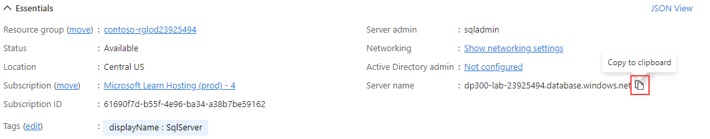
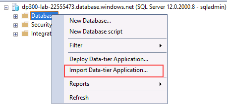
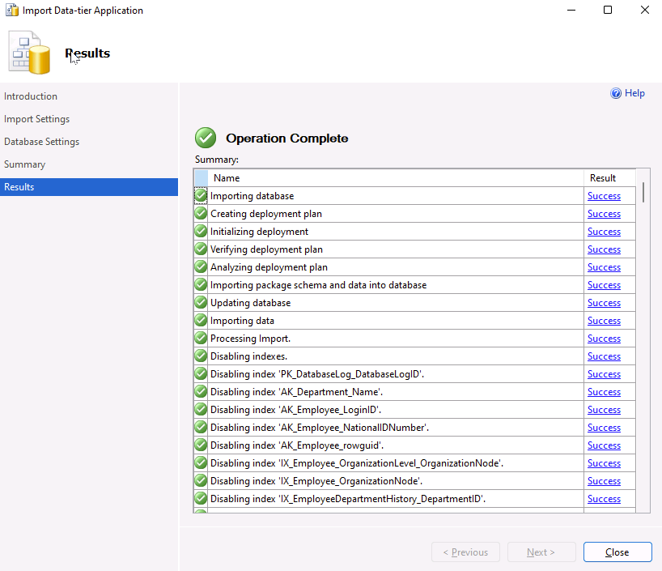

---
lab:
  title: 랩 4 - Azure SQL Database 방화벽 규칙 구성
  module: Implement a Secure Environment for a Database Service
---

# 안전한 환경 구현

**예상 시간:** 30분

학생들은 단원에서 파악한 정보를 사용하여 Azure Portal 및 AdventureWorks 내에서 보안 기능을 구성한 후 구현합니다.

선임 데이터베이스 관리자로 고용되어 데이터베이스 환경의 보안을 보장합니다. 작업은 Azure SQL Database에 중점을 둡니다.

**참고:** 이러한 연습에서는 T-SQL 코드를 복사하여 붙여넣고 기존 SQL 리소스를 활용하도록 요청합니다. 코드를 실행하기 전에 코드를 올바르게 복사했는지 확인하세요.

## Azure SQL Database 방화벽 규칙 구성

1. 랩 가상 머신에서 브라우저 세션을 시작하고 [https://portal.azure.com](https://portal.azure.com/)으로 이동합니다. 이 랩 가상 머신의 **리소스** 탭에 제공된 Azure **사용자 이름** 및 **암호**를 사용하여 포털에 연결합니다.

    

1. Azure Portal의 맨 위에 있는 검색 상자에서 “SQL Server”를 검색한 다음 옵션 목록에서 **SQL 서버**를 클릭합니다.

    

1. 세부 정보 페이지로 이동할 서버 이름 **dp300-lab-XXXXXXXX**를 선택합니다(SQL Server에 할당된 리소스 그룹 및 위치가 다를 수 있음).

    

1. SQL Server 세부 정보 화면에서 마우스를 서버 이름 오른쪽으로 이동한 후 아래와 같이 **클립보드에 복사** 단추를 선택합니다.

    

1. **네트워킹 설정 표시**를 선택합니다.

    

1. **네트워킹** 페이지에서 **+ 클라이언트 IPv4 주소 추가(IP 주소)** 를 클릭한 다음, **저장**을 클릭합니다.

    

    **참고:** 클라이언트 IP 주소가 자동으로 입력되었습니다. 목록에 클라이언트 IP 주소를 추가하면 SQL Server Management Studio 또는 다른 클라이언트 도구를 사용하여 Azure SQL Database에 연결할 수 있습니다. **클라이언트 IP 주소를 기록해두면 나중에 사용할 수 있습니다.**

1. SQL Server Management Studio를 엽니다. 서버에 연결 대화 상자에서 Azure SQL Database 서버의 이름을 붙여넣고 아래 자격 증명으로 로그인합니다.

    - **서버 이름:** &lt;여기에 Azure SQL Database 서버 이름 붙여넣기&gt;__
    - **인증:** SQL Server 인증
    - **서버 관리자 로그인:** sqladmin
    - **암호:** P@ssw0rd01

    

1. **연결**을 클릭합니다.

1. 개체 탐색기에서 서버 노드를 확장하고 **데이터베이스**를 마우스 오른쪽 단추로 클릭합니다. **데이터 계층 애플리케이션 가져오기**를 클릭합니다.

    

1. **데이터 계층 애플리케이션 가져오기** 대화 상자의 첫 번째 화면에서 **다음**을 클릭합니다.

1. **https://github.com/MicrosoftLearning/dp-300-database-administrator/blob/master/Instructions/Templates/AdventureWorksLT.bacpac**에 있는 .bacpac 파일을 랩 VM의 **C:\LabFiles\Secure Environment** 경로에 다운로드합니다(폴더 구조가 없는 경우 새로 만들기).

1. **가져오기 설정** 화면에서 **찾아보기**를 클릭하고 **C:\LabFiles\Secure Environment**로 이동하여 **AdventureWorksLT.bacpac** 파일을 클릭한 다음, **열기**를 클릭합니다. **데이터 계층 애플리케이션 가져오기** 화면에서 **다음**을 클릭합니다.

    

    

1. **데이터베이스 설정** 화면에서 아래와 같이 변경합니다.

    - **데이터베이스 이름:** AdventureWorksFromBacpac
    - **Microsoft Azure SQL Database의 버전**: 기본

    

1. **다음**을 클릭합니다.

1. **요약** 화면에서 **마침**을 클릭합니다. 가져오기가 완료되면 아래 결과가 표시됩니다. 그런 다음 **닫기**를 클릭합니다.

    

1. SQL Server Management Studio로 돌아가서 **개체 탐색기**의 **Databases** 폴더를 펼칩니다. 그런 다음 **AdventureWorksFromBacpac** 데이터베이스를 마우스 오른쪽 단추로 클릭한 다음 **새 쿼리**를 클릭합니다.

    

1. 텍스트를 쿼리 창에 붙여넣어 다음 T-SQL 쿼리를 실행합니다.
    1. **중요:** **000.000.000.00**을 클라이언트 IP 주소로 바꿉니다. **실행**을 클릭하거나 **F5** 키를 누릅니다.

    ```sql
    EXECUTE sp_set_database_firewall_rule 
            @name = N'AWFirewallRule',
            @start_ip_address = '000.000.000.00', 
            @end_ip_address = '000.000.000.00'
    ```

1. 다음으로 **AdventureWorksFromBacpac** 데이터베이스에 포함된 사용자를 만듭니다. **새 쿼리**를 클릭하고 다음 T-SQL을 실행합니다.

    ```sql
    USE [AdventureWorksFromBacpac]
    GO
    CREATE USER ContainedDemo WITH PASSWORD = 'P@ssw0rd01'
    ```

    

    **참고:** 이 명령은 **AdventureWorksFromBacpac** 데이터베이스 내에 포함된 사용자를 만듭니다. 다음 단계에서 이 자격 증명을 테스트합니다.

1. **개체 탐색기**로 이동합니다. **연결**을 클릭한 다음 **데이터베이스 엔진**을 클릭합니다.

    

1. 이전 단계에서 생성된 자격 증명을 사용하여 연결을 시도합니다. 다음 정보를 사용해야 합니다.

    - **로그인:** ContainedDemo
    - **암호:** P@ssw0rd01

     **연결**을 클릭합니다.

     다음과 같은 오류가 표시됩니다.

    

    **참고:** 연결 과정에서 사용자가 생성된 **AdventureWorksFromBacpac**이 아닌 *master* 데이터베이스에 로그인을 시도했기 때문에 이 오류가 생성되었습니다. **확인**을 클릭하고 연결 컨텍스트를 변경하여 오류 메시지를 종료한 다음, 아래와 같이 **서버에 연결** 대화 상자에서 **옵션 >>** 을 클릭합니다.

    

1. **연결 속성** 탭에서 데이터베이스 이름 **AdventureWorksFromBacpac**을 입력한 다음, **연결**을 클릭합니다.

    

1. **ContainedDemo** 사용자를 사용하여 성공적으로 인증할 수 있었습니다. 이번에는 새로 만든 사용자가 액세스할 수 있는 유일한 데이터베이스인 **AdventureWorksFromBacpac**에 직접 로그인했습니다.

    

이 연습에서는 Azure SQL Database에서 호스트되는 데이터베이스에 액세스하도록 서버 및 데이터베이스 방화벽 규칙을 구성했습니다. 또한 T-SQL 문을 사용하여 포함된 사용자를 만들고 SQL Server Management Studio를 사용하여 액세스를 확인했습니다.
