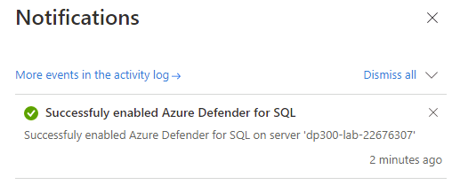
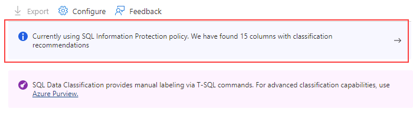

---
lab:
  title: 랩5 - -Microsoft Defender for SQL 및 데이터 분류 사용
  module: Implement a Secure Environment for a Database Service
---

# Microsoft Defender for SQL 및 데이터 분류 사용

**예상 소요 시간:** 20분

학생들은 단원에서 파악한 정보를 사용하여 Azure Portal 및 AdventureWorks 내에서 보안 기능을 구성한 후 구현합니다.

Senior Database 관리istrator로 고용되어 데이터베이스 환경의 보안을 보장합니다. 작업은 Azure SQL Database에 중점을 둡니다.

## Microsoft Defender for SQL 사용

1. 랩 가상 머신에서 브라우저 세션을 시작하고 [https://portal.azure.com](https://portal.azure.com/)으로 이동합니다. 이 랩 가상 머신의 **리소스** 탭에 제공된 Azure **사용자 이름** 및 **암호**를 사용하여 포털에 연결합니다.

    

1. Azure Portal의 맨 위에 있는 검색 상자에서 “SQL Server”를 검색한 다음 옵션 목록에서 **SQL 서버**를 클릭합니다.

    

1. 세부 정보 페이지로 이동할 서버 이름 **dp300-lab-XXXXXXXX**를 선택합니다(SQL Server에 할당된 리소스 그룹 및 위치가 다를 수 있음).

    

1. Azure SQL Server의 기본 블레이드에서 **보안** 섹션으로 이동하여 **Microsoft Defender for Cloud**를 선택합니다.

    

    **Microsoft Defender for Cloud** 페이지에서 **Microsoft Defender for SQL 사용**을 선택합니다.

1. Azure Defender for SQL을 사용하도록 설정한 후 다음 알림 메시지가 표시됩니다.

    

1. **클라우드용 Microsoft Defender** 페이지에서 **구성** 링크를 선택합니다(이 옵션을 보려면 페이지를 새로 고쳐야 할 수 있음).

    

1. **서버 설정** 페이지에서 MICROSOFT DEFENDER FOR SQL**의 **토글 스위치가 ON**으로 **설정되어 있는지 확인합니다.

## 데이터 분류 사용

1. Azure SQL 서버의 주 블레이드에서 **설정** 섹션으로 이동하고 **SQL 데이터베이스**를 선택한 다음 데이터베이스 이름을 선택합니다.

    

1. **AdventureWorksLT** 데이터베이스의 기본 블레이드에서 **보안** 섹션으로 이동한 다음, **데이터 검색 및 분류**를 선택합니다.

    

1. **데이터 검색 및 분류** 페이지에는 다음과 같은 정보 메시지가 표시됩니다. **현재 SQL Information Protection 정책을 사용하고 있습니다. 분류 권장 사항이 있는 15개의 열을 찾았습니다**. 해당 링크를 선택합니다.

    

1. 다음 **데이터 검색 및 분류** 화면에서 **모두 선택** 옆의 확인란을 선택하고, **선택한 권장 사항 적용**을 선택한 다음 **저장**을 선택하여 분류를 데이터베이스에 저장합니다.

    

1. **데이터 검색 및 분류** 화면으로 돌아가서 15개의 열이 5개의 다른 테이블에서 성공적으로 분류되었음을 확인합니다.

    

이 연습에서는 Microsoft Defender for SQL을 사용하도록 설정하여 Azure SQL Database의 보안을 강화해 보았습니다. 또한 Azure Portal 권장 사항에 따라 분류된 열을 만들었습니다.
