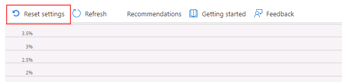

---
lab:
  title: 랩 6 - 모니터링을 통해 성능 문제 격리
  module: Monitor and optimize operational resources in Azure SQL
---

# <a name="isolate-performance-problems-through-monitoring"></a>모니터링을 통해 성능 문제 파악

**예상 소요 시간: 30분**

학생들은 단원에서 파악한 정보를 사용하여 AdventureWorks 내에서 진행되는 디지털 혁신 프로젝트의 결과물을 확인합니다. Azure Portal과 다른 도구를 살펴보며 학생은 도구를 활용하여 성능 관련 문제를 식별하고 해결하는 방법을 결정합니다.

데이터베이스 관리자는 성능 관련 문제를 식별하고 발견된 문제를 해결하는 실행 가능한 솔루션을 제공하도록 고용됩니다. Azure Portal을 사용하여 성능 문제를 식별한 다음 해결하는 방법을 제안해야 합니다.

**참고:** 이 연습을 진행할 때는 T-SQL 코드를 복사하여 붙여넣어야 합니다. 코드를 실행하기 전에 코드를 올바르게 복사했는지 확인하세요.

## <a name="review-cpu-utilization-in-azure-portal"></a>Azure Portal에서 CPU 사용률 검토

1. 랩 가상 머신에서 브라우저 세션을 시작하고 [https://portal.azure.com](https://portal.azure.com/)으로 이동합니다. 이 랩 가상 머신의 **리소스** 탭에 제공된 Azure **사용자 이름** 및 **암호**를 사용하여 포털에 연결합니다.

    

1. Azure Portal의 맨 위에 있는 검색 상자에서 “SQL Server”를 검색한 다음 옵션 목록에서 **SQL 서버**를 클릭합니다.

    

1. 세부 정보 페이지로 이동할 서버 이름 **dp300-lab-XXXXXXXX**를 선택합니다(SQL Server에 할당된 리소스 그룹 및 위치가 다를 수 있음).

    

1. Azure SQL 서버의 주 블레이드에서 **설정** 섹션으로 이동하고 **SQL 데이터베이스**를 선택한 다음 데이터베이스 이름을 선택합니다.

    

1. 데이터베이스 주 페이지에서 **서버 방화벽 설정**을 선택합니다.

    

1. **네트워킹** 페이지에서 **+ 클라이언트 IPv4 주소 추가(IP 주소)** 를 선택한 다음, **저장**을 선택합니다.

    

1. **네트워킹** 위의 탐색에서 **AdventureWorksLT**로 시작하는 링크를 선택합니다.

    

1. 왼쪽 탐색에서 **쿼리 편집기(미리 보기)** 를 선택합니다.

    

    **참고:** 이 기능은 미리 보기로 제공됩니다.

1. **암호**에서 **P@ssw0rd01** 을 입력하고 **확인**을 선택합니다.

    

1. **쿼리 1**에서 다음 쿼리를 입력하고 **실행**을 선택합니다.

    ```sql
    DECLARE @Counter INT 
    SET @Counter=1
    WHILE ( @Counter <= 10000)
    BEGIN
        SELECT 
             RTRIM(a.Firstname) + ' ' + RTRIM(a.LastName)
            , b.AddressLine1
            , b.AddressLine2
            , RTRIM(b.City) + ', ' + RTRIM(b.StateProvince) + '  ' + RTRIM(b.PostalCode)
            , CountryRegion
            FROM SalesLT.Customer a
            INNER JOIN SalesLT.CustomerAddress c 
                ON a.CustomerID = c.CustomerID
            RIGHT OUTER JOIN SalesLT.Address b
                ON b.AddressID = c.AddressID
        ORDER BY a.LastName ASC
        SET @Counter  = @Counter  + 1
    END
    ```

    

1. 쿼리가 완료될 때까지 기다립니다.

1. **AdventureWorksLT** 데이터베이스의 블레이드에서 **모니터링** 섹션의 **메트릭** 아이콘을 선택합니다.

    

1. **CPU 백분율**을 반영하도록 **메트릭** 메뉴 옵션을 변경한 다음, **평균** **집계**를 선택합니다. 그러면 지정된 시간 프레임의 평균 CPU 백분율이 표시됩니다.

    

1. 시간 경과에 따른 CPU 평균을 관찰합니다. 결과가 약간 다를 수 있습니다. 또는 쿼리를 여러 번 실행하여 보다 실질적인 결과를 얻을 수 있습니다.

    

## <a name="identify-high-cpu-queries"></a>높은 CPU 쿼리 식별

1. **AdventureWorksLT** 데이터베이스에 대한 블레이드의 **지능형 성능** 섹션에서 **Query Performance Insight** 아이콘을 찾습니다.

    

1. **설정 다시 설정**을 선택합니다.

    

1. 그래프 아래의 그리드에서 쿼리를 클릭합니다. 쿼리가 표시되지 않으면 2분 동안 기다린 후 **새로 고침**을 선택합니다.

    **참고:** 기간 및 쿼리 ID가 다를 수 있습니다. 둘 이상의 쿼리가 표시되면 각 쿼리를 클릭하여 결과를 확인합니다.

    

이 쿼리의 경우 총 기간이 1분을 초과했으며 10,000번가량 실행되었음을 확인할 수 있습니다.

이 연습에서는 Azure SQL Database의 서버 리소스를 탐색하고 Query Performance Insight를 통해 잠재적인 쿼리 성능 문제를 식별하는 방법을 알아보았습니다.
