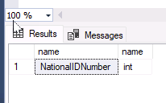

---
lab:
  title: 랩 9 - 데이터베이스 디자인 문제 식별
  module: Optimize query performance in Azure SQL
---

# 데이터베이스 디자인 문제 식별

**예상 시간:** 15분

학생들은 단원에서 파악한 정보를 사용하여 AdventureWorks 내에서 진행되는 디지털 혁신 프로젝트의 결과물을 확인합니다. Azure Portal과 다른 도구를 살펴보며, 학생은 기본 도구를 활용하여 성능 관련 문제를 식별하고 해결하는 방법을 결정합니다. 마지막으로 학생들은 정규화, 데이터 유형 선택, 인덱스 디자인 문제의 데이터베이스 디자인을 평가할 수 있습니다.

데이터베이스 관리자는 성능 관련 문제를 식별하고 발견된 문제를 해결하는 실행 가능한 솔루션을 제공하도록 고용됩니다. AdventureWorks는 10년 이상 소비자 및 유통업체에 자전거와 자전거 부품을 직접 판매해 왔습니다. 쿼리 성능 문제를 식별하고 이 모듈에서 배운 기술을 사용하여 문제를 해결하는 작업을 수행해야 합니다.

**참고:** 이 연습을 진행할 때는 T-SQL 코드를 복사하여 붙여넣어야 합니다. 코드를 실행하기 전에 코드를 올바르게 복사했는지 확인하세요.

## 데이터베이스 복원

1. **https://github.com/MicrosoftLearning/dp-300-database-administrator/blob/master/Instructions/Templates/AdventureWorks2017.bak**에 있는 데이터베이스 백업 파일을 랩 가상 머신의 **C:\LabFiles\Monitor and optimize** 경로에 다운로드합니다(폴더 구조가 없는 경우 새로 만들기).

    

1. Windows 시작 단추를 선택하고 SSMS를 입력합니다. 목록에서 **Microsoft SQL Server Management Studio 18**을 선택합니다.  

    

1. SSMS가 열리면 **서버에 연결** 대화 상자가 기본 인스턴스 이름으로 미리 채워집니다. **연결**을 선택합니다.

    

1. **데이터베이스** 폴더를 선택한 다음, **새 쿼리**를 선택합니다.

    

1. 새 쿼리 창에서 아래 T-SQL을 복사하여 붙여넣습니다. 쿼리를 실행하여 데이터베이스를 복원합니다.

    ```sql
    RESTORE DATABASE AdventureWorks2017
    FROM DISK = 'C:\LabFiles\Monitor and optimize\AdventureWorks2017.bak'
    WITH RECOVERY,
          MOVE 'AdventureWorks2017' 
            TO 'C:\LabFiles\Monitor and optimize\AdventureWorks2017.mdf',
          MOVE 'AdventureWorks2017_log'
            TO 'C:\LabFiles\Monitor and optimize\AdventureWorks2017_log.ldf';
    ```

    **참고:** 데이터베이스 백업 파일 이름 및 경로는 1단계에서 다운로드한 것과 일치해야 합니다. 일치하지 않으면 명령이 실패합니다.

1. 복원이 완료되면 성공 메시지가 표시되어야 합니다.

    

## 쿼리 검사 및 문제 파악

1. **새 쿼리**를 선택합니다. 다음 T-SQL 코드를 복사하여 쿼리 창에 붙여넣습니다. 이 쿼리를 실행하려면 **실행**을 선택합니다.

    ```sql
    USE AdventureWorks2017
    GO
    
    SELECT BusinessEntityID, NationalIDNumber, LoginID, HireDate, JobTitle
    FROM HumanResources.Employee
    WHERE NationalIDNumber = 14417807;
    ```

1. 쿼리를 실행하기 전에 아래 표시된 대로 **실제 실행 계획 포함** 아이콘을 선택하거나 **CTRL+M**을 누릅니다. 이렇게 하면 쿼리를 실행할 때 실행 계획이 표시됩니다. 이 쿼리를 실행하려면 **실행**을 선택합니다.

    

1. 결과 패널에서 **실행 계획** 탭을 선택하여 실행 계획으로 이동합니다. 실행 계획에서 `SELECT` 연산자를 마우스로 가리킵니다. 아래와 같이 노란색 삼각형 안의 느낌표로 식별된 경고 메시지가 표시됩니다. 경고 메시지 내용을 파악합니다.

    

## 경고 메시지 해결 방법 파악

*[HumanResources].[Employee]* 테이블 구조는 다음 DDL(데이터 정의 언어) 문에 표시됩니다. 이 DDL에 대해 이전 SQL 쿼리에서 사용된 필드를 해당 형식에 유의하여 검토합니다.

```sql
CREATE TABLE [HumanResources].[Employee](
     [BusinessEntityID] [int] NOT NULL,
     [NationalIDNumber] [nvarchar](15) NOT NULL,
     [LoginID] [nvarchar](256) NOT NULL,
     [OrganizationNode] [hierarchyid] NULL,
     [OrganizationLevel] AS ([OrganizationNode].[GetLevel]()),
     [JobTitle] [nvarchar](50) NOT NULL,
     [BirthDate] [date] NOT NULL,
     [MaritalStatus] [nchar](1) NOT NULL,
     [Gender] [nchar](1) NOT NULL,
     [HireDate] [date] NOT NULL,
     [SalariedFlag] [dbo].[Flag] NOT NULL,
     [VacationHours] [smallint] NOT NULL,
     [SickLeaveHours] [smallint] NOT NULL,
     [CurrentFlag] [dbo].[Flag] NOT NULL,
     [rowguid] [uniqueidentifier] ROWGUIDCOL NOT NULL,
     [ModifiedDate] [datetime] NOT NULL
) ON [PRIMARY]
```

1. 실행 계획에 표시되는 경고 메시지에 따르면 어떤 변경 내용이 권장되나요?

    1. 암시적 변환을 야기하는 필드와 이유를 파악합니다. 
    1. 쿼리를 검토하세요.

        ```sql
        SELECT BusinessEntityID, NationalIDNumber, LoginID, HireDate, JobTitle
        FROM HumanResources.Employee
        WHERE NationalIDNumber = 14417807;
        ```

        `WHERE` 절의 *NationalIDNumber* 열과 비교되는 값은 **14417807**이 따옴표로 묶인 문자열에 없으므로 숫자로 비교하게 됩니다. 

        테이블 구조를 검사한 후 *NationalIDNumber* 열이 `INT` 데이터 형식이 아닌 `NVARCHAR` 데이터 형식을 사용하고 있음을 확인할 수 있습니다. 이러한 불일치로 인해 데이터베이스 최적화 프로그램은 최적이 아닌 계획을 만들어 암시적인 방식으로 쿼리 성능에 추가 오버헤드를 초래하는 `NVARCHAR` 값으로 숫자를 변환합니다.

암시적 변환 경고를 수정하기 위해 구현할 수 있는 두 가지 방법이 있습니다. 다음 단계에서 각 항목을 조사할 것입니다.

### 코드 변경

1. 암시적 변환을 해결하기 위해 코드를 어떻게 변환하시겠어요? 코드를 변경하고 쿼리를 다시 실행합니다.

    아직 활성화되지 않은 경우 **실제 실행 계획 포함**(**CTRL+M**)을 활성화해야 합니다. 

    이 시나리오에서는 값의 양쪽에 작은따옴표를 추가하기만 하면 값이 숫자에서 문자 형식으로 변경됩니다. 이 쿼리에 대해 쿼리 창을 열어 둡니다.

    업데이트된 SQL 쿼리를 실행하세요.

    ```sql
    SELECT BusinessEntityID, NationalIDNumber, LoginID, HireDate, JobTitle
    FROM HumanResources.Employee
    WHERE NationalIDNumber = '14417807';
    ```

    

    **참고:** 이제 경고 메시지가 사라지고 쿼리 계획이 개선되었습니다. *NationalIDNumber* 열과 비교되는 값이 테이블의 열 데이터 형식과 일치하도록 `WHERE` 절을 변경하면 최적화 프로그램에서 암시적 변환을 제거할 수 있습니다.

### 데이터 형식 변경

1. 테이블 구조를 변경하여 암시적 변환 경고를 수정할 수도 있습니다.

    인덱스를 수정하려면 아래 쿼리를 복사하여 새 쿼리 창에 붙여넣는 방법으로 열의 데이터 형식을 변경합니다. **실행**을 선택하거나 <kbd>F5</kbd> 키를 눌러 쿼리를 실행해 봅니다.

    ```sql
    ALTER TABLE [HumanResources].[Employee] ALTER COLUMN [NationalIDNumber] INT NOT NULL;
    ```

    *NationalIDNumber* 열 데이터 형식을 INT로 변경하면 변환 문제가 해결됩니다. 하지만 이 변경으로 인해 데이터베이스 관리자가 해결해야 할 또 다른 문제가 발생합니다.

    

    *NationalIDNumber* 열은 이미 기존 비클러스터형 인덱스의 일부이므로 데이터 형식을 변경하려면 인덱스를 다시 작성하거나 다시 만들어야 합니다. **이로 인해 프로덕션의 가동 중지 시간이 길어질 수 있으며, 이는 디자인에서 올바른 데이터 형식을 선택하는 것이 중요함을 잘 보여줍니다.**

1. 이 문제를 해결하려면 아래 코드를 복사하여 쿼리 창에 붙여넣고 **실행**을 선택하여 코드를 실행합니다.

    ```sql
    USE AdventureWorks2017
    GO
    
    --Dropping the index first
    DROP INDEX [AK_Employee_NationalIDNumber] ON [HumanResources].[Employee]
    GO

    --Changing the column data type to resolve the implicit conversion warning
    ALTER TABLE [HumanResources].[Employee] ALTER COLUMN [NationalIDNumber] INT NOT NULL;
    GO

    --Recreating the index
    CREATE UNIQUE NONCLUSTERED INDEX [AK_Employee_NationalIDNumber] ON [HumanResources].[Employee]( [NationalIDNumber] ASC );
    GO
    ```

1. 또는 아래 쿼리를 실행하여 데이터 형식이 성공적으로 변경되었는지 확인할 수 있습니다.

    ```sql
    SELECT c.name, t.name
    FROM sys.all_columns c INNER JOIN sys.types t
        ON (c.system_type_id = t.user_type_id)
    WHERE OBJECT_ID('[HumanResources].[Employee]') = c.object_id
        AND c.name = 'NationalIDNumber'
    ```
    
    
    
1. 이제 실행 계획을 확인해 보겠습니다. 따옴표 없이 원래 쿼리를 다시 실행합니다.

    ```sql
    USE AdventureWorks2017
    GO

    SELECT BusinessEntityID, NationalIDNumber, LoginID, HireDate, JobTitle
    FROM HumanResources.Employee
    WHERE NationalIDNumber = 14417807;
    ```

    

    쿼리 계획을 검사하고 이제 암시적 변환 경고 없이 정수를 사용하여 *NationalIDNumber*로 필터링할 수 있습니다. 이제 SQL 쿼리 최적화 프로그램에서 최적의 계획을 생성하고 실행할 수 있습니다.

이 연습에서는 암시적 데이터 형식 변환으로 인한 쿼리 문제를 식별하는 방법과 이를 수정하여 쿼리 계획을 개선하는 방법을 알아보았습니다.
