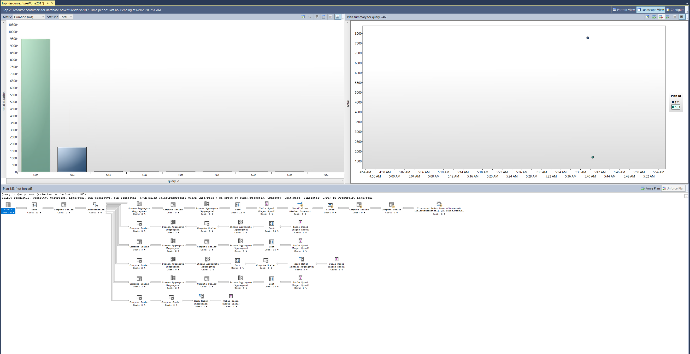

---
lab:
  title: 랩 10 - SQL Database의 성능이 저조한 쿼리에서 문제 영역 격리
  module: Optimize query performance in Azure SQL
---

# SQL Database의 성능이 저조한 쿼리에서 문제 영역 격리

**예상 시간:** 30분

사용자가 *AdventureWorks2017* 데이터베이스를 쿼리하는 경우 발생하고 있는 성능 문제를 해결할 선임 데이터베이스 관리자로 고용되었습니다. 쿼리 성능 문제를 식별하고 이 모듈에서 배운 기술을 사용하여 문제를 해결하는 작업을 수행해야 합니다.

최적이 아닌 성능으로 쿼리를 실행하고 쿼리 계획을 검사하며 데이터베이스에서 개선하려고 합니다.

**참고:** 이 연습을 진행할 때는 T-SQL 코드를 복사하여 붙여넣어야 합니다. 코드를 실행하기 전에 코드를 올바르게 복사했는지 확인하세요.

## 데이터베이스 복원

1. **https://github.com/MicrosoftLearning/dp-300-database-administrator/blob/master/Instructions/Templates/AdventureWorks2017.bak**에 있는 데이터베이스 백업 파일을 랩 가상 머신의 **C:\LabFiles\Monitor and optimize** 경로에 다운로드합니다(폴더 구조가 없는 경우 새로 만들기).

    

1. Windows 시작 단추를 선택하고 SSMS를 입력합니다. 목록에서 **Microsoft SQL Server Management Studio 18**을 선택합니다.  

    

1. SSMS가 열리면 **서버에 연결** 대화 상자가 기본 인스턴스 이름으로 미리 채워집니다. **연결**을 선택합니다.

    

1. **데이터베이스** 폴더를 선택한 다음, **새 쿼리**를 선택합니다.

    

1. 새 쿼리 창에서 아래 T-SQL을 복사하여 붙여넣습니다. 쿼리를 실행하여 데이터베이스를 복원합니다.

    ```sql
    RESTORE DATABASE AdventureWorks2017
    FROM DISK = 'C:\LabFiles\Monitor and optimize\AdventureWorks2017.bak'
    WITH RECOVERY,
          MOVE 'AdventureWorks2017' 
            TO 'C:\LabFiles\Monitor and optimize\AdventureWorks2017.mdf',
          MOVE 'AdventureWorks2017_log'
            TO 'C:\LabFiles\Monitor and optimize\AdventureWorks2017_log.ldf';
    ```

    **참고:** 데이터베이스 백업 파일 이름 및 경로는 1단계에서 다운로드한 것과 일치해야 합니다. 일치하지 않으면 명령이 실패합니다.

1. 복원이 완료되면 성공 메시지가 표시되어야 합니다.

    

## 실제 실행 계획 생성

SQL Server Management Studio에서 실행 계획을 생성하는 방법은 여러 가지가 있습니다.

1. **새 쿼리**를 선택합니다. 다음 T-SQL 코드를 복사하여 쿼리 창에 붙여넣습니다. 이 쿼리를 실행하려면 **실행**을 선택합니다.

    **참고:** **SHOWPLAN_ALL**을 사용하면 별도의 탭에서 그래픽 대신 결과 창에서 쿼리 실행 계획의 텍스트 버전을 볼 수 있습니다.

    ```sql
    USE AdventureWorks2017;
    GO

    SET SHOWPLAN_ALL ON;
    GO

    SELECT BusinessEntityID
    FROM HumanResources.Employee
    WHERE NationalIDNumber = '14417807';
    GO

    SET SHOWPLAN_ALL OFF;
    GO
    ```

    **SELECT** 문의 실제 쿼리 결과 대신 실행 계획의 텍스트 버전이 표시됩니다.

    

1. 잠시 시간을 내어 **StmtText** 열의 두 번째 행에 있는 텍스트를 살펴봅니다.

    ```console
    |--Index Seek(OBJECT:([AdventureWorks2017].[HumanResources].[Employee].[AK_Employee_NationalIDNumber]), SEEK:([AdventureWorks2017].[HumanResources].[Employee].[NationalIDNumber]=CONVERT_IMPLICIT(nvarchar(4000),[@1],0)) ORDERED FORWARD)
    ```

    위의 텍스트는 실행 계획에서 **AK_Employee_NationalIDNumber** 키에 **Index Seek**를 사용하는 것을 설명합니다. **CONVERT_IMPLICIT** 단계를 수행하는 데 필요한 실행 계획도 보여 줍니다.

    쿼리 최적화 프로그램은 필요한 레코드를 가져오는 데 적합한 인덱스를 찾을 수 있었습니다.

## 만족스럽지 못한 쿼리 계획 해결

1. 아래 코드를 복사하여 새 쿼리 창에 붙여넣습니다.

    쿼리를 실행하기 전에 아래 표시된 대로 **실제 실행 계획 포함** 아이콘을 선택하거나 <kbd>CTRL</kbd>+<kbd>M</kbd>을 누릅니다. **실행**을 선택하거나 <kbd>F5</kbd> 키를 눌러 쿼리를 실행합니다. 메시지 탭의 실행 계획 및 논리 읽기를 기록해 둡니다.

    ```sql
    SET STATISTICS IO, TIME ON;

    SELECT [SalesOrderID] ,[CarrierTrackingNumber] ,[OrderQty] ,[ProductID], [UnitPrice] ,[ModifiedDate]
    FROM [AdventureWorks2017].[Sales].[SalesOrderDetail]
    WHERE [ModifiedDate] > '2012/01/01' AND [ProductID] = 772;
    ```

    

    실행 계획을 검토할 때 **Key Lookup**이 있음을 알 수 있습니다. 아이콘 위로 마우스를 가져가면 쿼리에서 검색한 행마다 수행됨을 나타내는 속성이 표시됩니다. 실행 계획이 **Key Lookup** 작업을 수행하고 있음을 확인할 수 있습니다.

    

    **Output List** 섹션의 열을 기록해 둡니다. 이 쿼리를 개선할 방법은 무엇인가요?

    키 조회를 제거하기 위해 변경해야 하는 인덱스를 식별하려면 위의 Index Seek를 검사해야 합니다. 마우스를 사용하여 Index Seek 연산자를 가리키면 연산자의 속성이 표시됩니다.

    

1. **Key Lookups**는 쿼리에서 반환되거나 검색되는 모든 필드를 포함(INCLUDES)하는 모든 포함(COVERING) 인덱스를 추가하여 제거할 수 있습니다. 이 예에서 인덱스는 **ProductID** 열만 사용합니다. **Key Lookup**을 수정하고 쿼리를 다시 실행하여 새 계획을 확인합니다.

    ```sql
    CREATE NONCLUSTERED INDEX [IX_SalesOrderDetail_ProductID] ON [Sales].[SalesOrderDetail]
    ([ProductID] ASC)
    ```

    **Output List** 필드를 인덱스에 포함 열로 추가하면 **Key Lookup**이 제거됩니다. 인덱스가 이미 있으므로 인덱스를 삭제(DROP)하고 다시 만들거나 **DROP_EXISTING=ON**으로 설정해야 열을 추가할 수 있습니다. **ProductID** 열은 이미 인덱스의 일부이므로 포함 열로 추가할 필요가 없습니다. **ModifiedDate**를 추가하여 인덱스에 대해 수행할 수 있는 또 다른 성능 개선 사항이 있습니다.

    ```sql
    CREATE NONCLUSTERED INDEX [IX_SalesOrderDetail_ProductID]
    ON [Sales].[SalesOrderDetail] ([ProductID],[ModifiedDate])
    INCLUDE ([CarrierTrackingNumber],[OrderQty],[UnitPrice])
    WITH (DROP_EXISTING = on);
    GO
    ```

1. 1단계에서 쿼리를 다시 실행합니다. 논리 읽기의 변경 내용과 실행 계획 변경 내용을 기록해 둡니다. 이제 계획에서 작성한 비클러스터형 인덱스만 사용하면 됩니다.

    

## 쿼리 저장소를 사용하여 회귀 감지 및 처리

다음으로 워크로드를 실행하여 쿼리 저장소의 쿼리 통계를 생성하고, **상위 리소스 소비 쿼리** 보고서를 검사하여 성능 저하를 식별하고, 더 나은 실행 계획을 적용하는 방법을 확인합니다.

1. **새 쿼리**를 선택합니다. 다음 T-SQL 코드를 복사하여 쿼리 창에 붙여넣습니다. 이 쿼리를 실행하려면 **실행**을 선택합니다.

    이 스크립트는 AdventureWorks2017 데이터베이스의 쿼리 저장소 기능을 사용하도록 설정하고 데이터베이스를 호환성 수준 100으로 설정합니다.

    ```sql
    USE [master];
    GO

    ALTER DATABASE [AdventureWorks2017] SET QUERY_STORE = ON;
    GO

    ALTER DATABASE [AdventureWorks2017] SET QUERY_STORE (OPERATION_MODE = READ_WRITE);
    GO

    ALTER DATABASE [AdventureWorks2017] SET COMPATIBILITY_LEVEL = 100;
    GO
    ```

    호환성 수준을 변경하는 것은 데이터베이스를 이전으로 되돌리는 것과 같습니다. SQL Server에서 사용할 수 있는 기능을 SQL Server 2008에서 사용할 수 있는 기능으로 제한합니다.

1. **https://github.com/MicrosoftLearning/dp-300-database-administrator/blob/master/Instructions/Templates/CreateRandomWorkloadGenerator.sql**에 있는 T-SQL 스크립트를 랩 가상 머신의 **C:\LabFiles\Monitor and optimize** 경로에 다운로드합니다.

1. **https://github.com/MicrosoftLearning/dp-300-database-administrator/blob/master/Instructions/Templates/ExecuteRandomWorkload.sql**에 있는 T-SQL 스크립트를 랩 가상 머신의 **C:\LabFiles\Monitor and optimize** 경로에 다운로드합니다.

1. SQL Server Management Studio에서 **파일** > **열기** > **파일** 메뉴를 선택합니다.

1. **C:\LabFiles\Monitor and optimize\CreateRandomWorkloadGenerator.sql** 파일로 이동합니다.

1. SQL Server Management Studio를 열면 **실행**을 선택하거나 <kbd>F5</kbd> 키를 눌러 쿼리를 실행합니다.

1. 새 쿼리 편집기에서 **C:\LabFiles\Monitor and optimize\ExecuteRandomWorkload.sql** 파일을 열고 **실행**을 선택하거나 <kbd>F5</kbd> 키를 눌러 쿼리를 실행합니다.

1. 실행이 완료되면 스크립트를 다시 실행하여 서버에 추가 로드를 만듭니다. 이 쿼리를 위해 쿼리 탭은 열어 둡니다.

1. 아래 코드를 복사하여 새 쿼리 창에 붙여넣고 **실행**을 선택하거나 <kbd>F5</kbd> 키를 눌러 실행합니다. 

    이 스크립트는 데이터베이스 호환성 모드를 SQL Server 2019(**150**)로 변경합니다. 이제 SQL Server 2008 이후의 모든 기능과 개선 사항을 데이터베이스에서 사용할 수 있습니다.

    ```sql
    USE [master];
    GO

    ALTER DATABASE [AdventureWorks2017] SET COMPATIBILITY_LEVEL = 150;
    GO
    ```

1. **ExecuteRandomWorkload.sql** 파일에서 쿼리 탭으로 돌아가서 다시 실행합니다.

## 리소스를 가장 많이 사용하는 쿼리 보고서 조사

1. 쿼리 저장소 노드를 보려면 SQL Server Management Studio에서 AdventureWorks2017 데이터베이스를 새로 고쳐야 합니다. 데이터베이스 이름을 마우스 오른쪽 단추로 클릭하고 **새로 고침**을 선택합니다. 그러면 데이터베이스에 쿼리 저장소 노드가 표시됩니다.

    

1. **쿼리 저장소** 노드를 펼쳐 사용 가능한 모든 보고서를 표시합니다. **상위 리소스 소비 쿼리** 보고서를 선택합니다.

    

1. 아래 표시된 대로 보고서가 열립니다. 오른쪽에서 메뉴 드롭다운을 선택하고 **구성**을 선택합니다.

    

1. 구성 화면에서 최소 쿼리 계획 수의 필터를 2로 변경합니다. 그런 다음, **확인**을 선택합니다.

    

1. 보고서의 왼쪽 상단 부분에 있는 막대 차트에서 가장 왼쪽에 있는 막대를 선택하여 기간이 가장 긴 쿼리를 선택합니다.

    

    이렇게 하면 쿼리 저장소에서 가장 기간이 긴 쿼리에 대한 쿼리 및 계획 요약이 표시됩니다.

## 더 나은 실행 계획 강제 적용

1. 아래와 같이 보고서의 계획 요약 부분으로 이동합니다. 서로 기간이 상당히 다른 두 실행 계획이 있음을 알 수 있습니다.

    

1. 보고서의 오른쪽 상단 창에서 기간이 가장 짧은 계획 ID(차트의 Y축에서 아래 위치에 표시됨)를 선택합니다. 위의 그래픽에서 *PlanID 43*입니다. 계획 요약 차트 옆에 있는 계획 ID를 선택합니다(위 스크린샷처럼 강조 표시되어야 함).

1. 요약 차트에서 **계획 강제 적용**을 선택합니다. 확인 창이 팝업되면 **예**를 선택합니다.

    

    계획이 강제 적용되면 **강제 계획**이 이제 회색으로 표시되고 계획 요약 창의 계획에는 강제로 적용되었음을 나타내는 체크 표시가 나타납니다.

    쿼리 최적화 프로그램이 사용할 실행 계획을 잘못 선택하는 경우가 있습니다. 이 경우 성능을 향상시킬 것으로 확신할 때 SQL Server에서 사용자가 원하는 계획을 사용하도록 강제할 수 있습니다.

## 쿼리 힌트를 사용하여 성능에 영향을 미칩니다.

그런 다음 워크로드를 실행하고 매개 변수를 사용하도록 쿼리를 변경한 다음, 쿼리에 쿼리 힌트를 적용하여 다시 실행합니다.

연습을 계속하기 전에 **Window** 메뉴를 선택하여 현재 쿼리 창을 모두 닫은 다음 **모든 문서 닫기**를 선택합니다. 팝업에서 **아니요**를 선택합니다.

1. **새 쿼리**를 선택한 다음, 쿼리를 실행하기 전에 **실제 실행 계획 포함** 아이콘을 선택하거나 <kbd>CTRL</kbd>+<kbd>M</kbd>을 사용합니다.

    

1. 아래 쿼리를 실행합니다. 실행 계획은 Index Seek 연산자를 표시합니다.

    ```sql
    USE AdventureWorks2017;
    GO

    SELECT SalesOrderId, OrderDate
    FROM Sales.SalesOrderHeader
    WHERE SalesPersonID=288;
    ```

    

1. 새 쿼리 창에서 다음 쿼리를 실행합니다. 두 실행 계획을 비교합니다.

    ```sql
    USE AdventureWorks2017;
    GO

    SELECT SalesOrderId, OrderDate
    FROM Sales.SalesOrderHeader
    WHERE SalesPersonID=277;
    ```

    이번 변경에서는 SalesPersonID 값이 277로만 설정됩니다. 실행 계획에서 클러스터형 인덱스 스캔 작업을 확인합니다.

    

보이는 바와 같이 인덱스 통계를 기반으로 하는 쿼리 최적화 프로그램에서는 `WHERE` 절의 다른 값 때문에 다른 실행 계획을 선택했습니다.

*SalesPersonID* 값만 변경한 경우 계획이 다른 이유는 무엇인가요?

이 쿼리에서는 `WHERE` 절에 상수를 사용하며 최적화 프로그램은 각 쿼리를 고유하게 표시하고 매번 다른 실행 계획을 생성합니다.

## 변수를 사용하고 쿼리 힌트를 사용하도록 쿼리 변경

1. SalesPersonID의 변수 값을 사용하도록 쿼리를 변경합니다.

1. **WHERE**절에 값을 하드 코딩하지 않고 값을 전달할 수 있도록 T-SQL **DECLARE**문을 사용하여 <strong>@SalesPersonID</strong>를 선언합니다. 암시적 변환을 방지하려면 변수의 데이터 형식이 대상 테이블에 있는 열의 데이터 형식과 일치하는지 확인해야 합니다.

    ```sql
    USE AdventureWorks2017;
    GO

    SET STATISTICS IO, TIME ON;

    DECLARE @SalesPersonID INT;

    SELECT @SalesPersonID = 288;

    SELECT SalesOrderId, OrderDate
    FROM Sales.SalesOrderHeader
    WHERE SalesPersonID= @SalesPersonID;
    ```

    실행 계획을 살펴보면 결과를 얻기 위해 인덱스 스캔을 사용하고 있음을 알 수 있습니다. 쿼리 최적화 프로그램은 런타임까지 지역 변수의 값을 알 수 없기 때문에 적절하게 최적화를 수행할 수 없습니다.

1. 쿼리 힌트를 제공하여 쿼리 최적화 프로그램에서 더 나은 선택을 하도록 도울 수 있습니다. `OPTION (RECOMPILE)`을 사용하여 위의 쿼리를 다시 실행합니다.

    ```sql
    USE AdventureWorks2017
    GO

    SET STATISTICS IO, TIME ON;

    DECLARE @SalesPersonID INT;

    SELECT @SalesPersonID = 288;

    SELECT SalesOrderId, OrderDate
    FROM Sales.SalesOrderHeader
    WHERE SalesPersonID= @SalesPersonID
    OPTION (RECOMPILE);
    ```

    쿼리 최적화 프로그램에서 더 효율적인 실행 계획을 선택할 수 있습니다. `RECOMPILE` 옵션을 사용하면 쿼리 컴파일러가 변수를 해당 값으로 바꿉니다.

    통계를 비교하면 메시지 탭에서 쿼리 힌트가 없는 쿼리의 경우 논리적 읽기 간의 차이가 **68%**(689 대 409) 더 많다는 것을 알 수 있습니다.

이 연습에서는 쿼리 문제를 식별하는 방법과 쿼리 계획을 개선하기 위해 문제를 해결하는 방법을 알아보았습니다.
