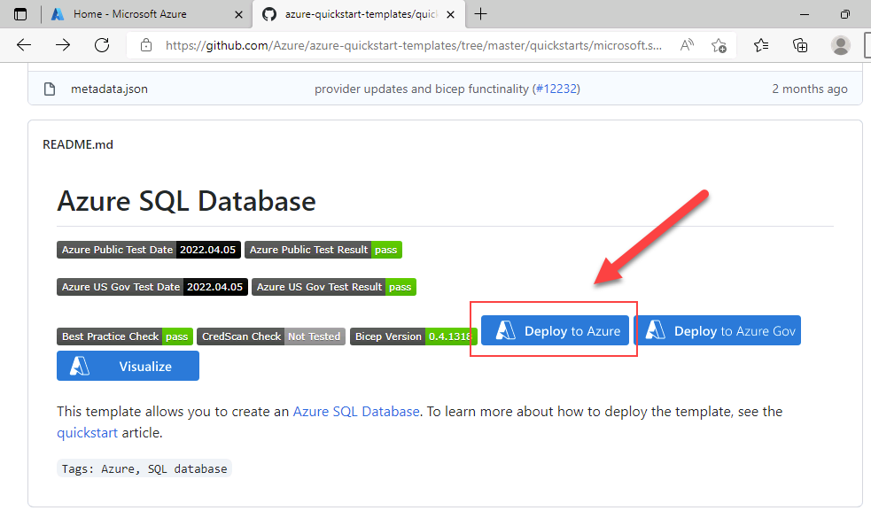

---
lab:
  title: 랩 11 - Azure Resource Manager 템플릿을 사용하여 Azure SQL Database 배포
  module: Automate database tasks for Azure SQL
---

# 템플릿에서 Azure SQL Database 배포

**예상 시간:** 15분

데이터베이스 관리의 일상적인 작업을 자동화하는 데 도움을 주는 선임 데이터 엔지니어로 고용되었습니다. 이와 같은 자동화를 통해 AdventureWorks용 데이터베이스가 최고의 성능으로 계속 작동하고 특정 조건에 따라 경고를 제공하는 메서드를 제공할 수 있습니다. AdventureWorks는 IaaS(Infrastructure as a Service) 및 PaaS(Platform as a Service) 제품 모두에서 SQL Server를 사용합니다.

## Azure Resource Manager 템플릿 살펴보기

1. Microsoft Edge에서 새 탭을 열고 GitHub 리포지토리의 다음 경로로 이동합니다. 여기에는 SQL Database 리소스를 배포하는 ARM 템플릿이 들어 있습니다.

    ```url
    https://github.com/Azure/azure-quickstart-templates/tree/master/quickstarts/microsoft.sql/sql-database
    ```

1. **azuredeploy.json**을 마우스 오른쪽 단추로 클릭하고 **새 탭에서 링크 열기**를 선택하여 ARM 템플릿을 봅니다. 다음과 같은 템플릿이 표시됩니다.

    ```JSON
    {
    "$schema": "https://schema.management.azure.com/schemas/2019-04-01/deploymentTemplate.json#",
    "contentVersion": "1.0.0.0",
    "parameters": {
        "serverName": {
        "type": "string",
        "defaultValue": "[uniqueString('sql', resourceGroup().id)]",
        "metadata": {
            "description": "The name of the SQL logical server."
        }
        },
        "sqlDBName": {
        "type": "string",
        "defaultValue": "SampleDB",
        "metadata": {
            "description": "The name of the SQL Database."
        }
        },
        "location": {
        "type": "string",
        "defaultValue": "[resourceGroup().location]",
        "metadata": {
            "description": "Location for all resources."
        }
        },
        "administratorLogin": {
        "type": "string",
        "metadata": {
            "description": "The administrator username of the SQL logical server."
        }
        },
        "administratorLoginPassword": {
        "type": "securestring",
        "metadata": {
            "description": "The administrator password of the SQL logical server."
        }
        }
    },
    "variables": {},
    "resources": [
        {
        "type": "Microsoft.Sql/servers",
        "apiVersion": "2020-02-02-preview",
        "name": "[parameters('serverName')]",
        "location": "[parameters('location')]",
        "properties": {
            "administratorLogin": "[parameters('administratorLogin')]",
            "administratorLoginPassword": "[parameters('administratorLoginPassword')]"
        },
        "resources": [
            {
            "type": "databases",
            "apiVersion": "2020-08-01-preview",
            "name": "[parameters('sqlDBName')]",
            "location": "[parameters('location')]",
            "sku": {
                "name": "Standard",
                "tier": "Standard"
            },
            "dependsOn": [
                "[resourceId('Microsoft.Sql/servers', concat(parameters('serverName')))]"
            ]
            }
        ]
        }
    ]
    }
    ```

1. JSON 속성을 검토하고 관찰합니다.

1. **azuredeploy.json** 탭을 닫고 **sql-database** GitHub 폴더를 포함하는 탭으로 돌아갑니다. 아래로 스크롤하여 **Azure에 배포**를 선택합니다.

    

1. **SQL Server 및 데이터베이스 만들기** 빠른 시작 템플릿 페이지가 Azure Portal에서 열리고 ARM 템플릿에서 리소스 세부 정보가 부분적으로 채워집니다. 아래 정보를 사용하여 빈 필드를 완료합니다.

    - **리소스 그룹:** *contoso-rg*로 시작
    - **Sql 관리자 로그인:** labadmin
    - **Sql 관리자 로그인 암호:** &lt;강력한 암호 입력&gt;

1. **검토 및 생성**를 선택한 후 **생성**를 선택합니다. 배포에는 5분 정도 걸립니다.

    

1. 배포가 완료되면 **리소스 그룹으로 이동**을 선택합니다. 배포에서 만든 임의로 명명된 **SQL Server** 리소스를 포함하는 Azure 리소스 그룹으로 이동합니다.

    

---

## 리소스 정리

다른 용도로 Azure SQL Server를 사용하지 않는 경우 이 랩에서 만든 리소스를 정리할 수 있습니다.

### 리소스 그룹 삭제

이 랩에 대한 새 리소스 그룹을 만든 경우 리소스 그룹을 삭제하여 이 랩에서 만든 모든 리소스를 제거할 수 있습니다.

1. Azure Portal의 왼쪽 탐색 창에서 **리소스 그룹**을 선택하거나 검색 창에서 **리소스 그룹**을 검색하고 결과에서 선택합니다.

1. 이 랩을 위해 만든 리소스 그룹으로 이동합니다. 리소스 그룹에는 Azure SQL Server 및 이 랩에서 만든 기타 리소스가 포함됩니다.

1. 위쪽 메뉴에서 **리소스 그룹 삭제**를 선택합니다.

1. **리소스 그룹 삭제** 대화 상자에서 확인할 리소스 그룹의 이름을 입력한 다음 **삭제**를 선택합니다.

1. 리소스 그룹이 삭제될 때까지 기다립니다.

1. Azure Portal을 닫습니다.

### 랩 리소스만 삭제합니다.

이 랩에 대한 새 리소스 그룹을 만들지 않았고 리소스 그룹과 이전 리소스를 그대로 유지하려는 경우 이 랩에서 만든 리소스를 계속 삭제할 수 있습니다.

1. Azure Portal의 왼쪽 탐색 창에서 **리소스 그룹**을 선택하거나 검색 창에서 **리소스 그룹**을 검색하고 결과에서 선택합니다.

1. 이 랩을 위해 만든 리소스 그룹으로 이동합니다. 리소스 그룹에는 Azure SQL Server 및 이 랩에서 만든 기타 리소스가 포함됩니다.

1. 랩에서 이전에 지정한 SQL Server 이름이 접두사로 지정된 모든 리소스를 선택합니다.

1. 위쪽 메뉴에서 **삭제**를 선택합니다.

1. **리소스 삭제** 대화 상자에서 **삭제**를 입력하고 **삭제**를 선택합니다.

1. 리소스 삭제를 확인하려면 **삭제**를 다시 선택합니다.

1. 리소스가 삭제될 때까지 기다립니다.

1. Azure Portal을 닫습니다.

---

이 랩을 성공적으로 완료하셨습니다.

Azure Resource Manager 템플릿 링크를 한 번 클릭하여 Azure SQL 서버와 데이터베이스를 쉽게 만드는 방법을 알아보았습니다.
