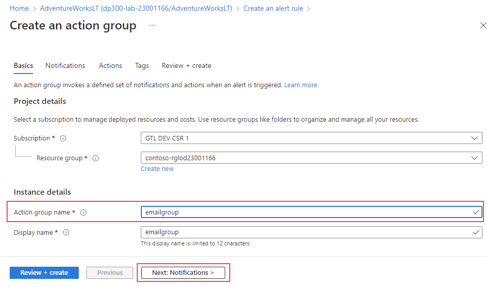

---
lab:
  title: 랩 12 - SQL Server의 CPU 상태 경고 만들기
  module: Automate database tasks for Azure SQL
---

# Azure에서 SQL Server의 CPU 상태 경고 만들기

**예상 소요 시간: 30분**

데이터베이스 관리의 일상적인 업무를 자동화하는 데 도움을 주는 선임 데이터 엔지니어로 고용되었습니다. 이 자동화에서는 AdventureWorks용 데이터베이스가 최고 성능으로 계속 작동하고 특정 조건에 따라 경고하는 메서드를 제공하도록 지원합니다.

## CPU가 80%의 평균을 초과하는 경우 경고 생성

1. Azure Portal 위쪽의 검색 창에서 **SQL**을 입력하고 **SQL 데이터베이스**를 선택합니다. 나열된 **AdventureWorksLT** 데이터베이스 이름을 선택합니다.

    

1. **AdventureWorksLT** 데이터베이스의 기본 블레이드에서 모니터링 섹션으로 아래로 이동합니다. **경고**를 선택합니다.

    

1. **경고 규칙 만들기**를 선택합니다.

    

1. **신호 선택** 슬라이드에서 **CPU 백분율**을 선택합니다.

    

1. **신호 구성** 슬라이드에서 **임계값** 속성의 **정적**을 선택합니다. **연산자** 속성이 **보다 큼**이고 **집계** 유형이 **평균**인지 확인합니다. 그런 다음 **임계값**에 값 **80**을 입력합니다. **완료**를 선택합니다.

    

1. **작업** 탭을 선택합니다.

    

1. **작업** 탭에서 **작업 그룹 만들기**를 선택합니다.

    

1. **작업 그룹** 화면에서 **작업 그룹 이름** 필드에 **emailgroup**을 입력한 다음, **다음: 알림**을 선택합니다.

    

1. **알림** 탭에서 다음 정보를 입력합니다.

    - **알림 유형:** 메일/SMS 메시지/푸시/음성
        - **참고:** 이 옵션을 선택하면 메일/SMS 메시지/푸시/음성 플라이아웃이 표시됩니다. 메일 속성을 확인하고 로그인할 때 사용한 Azure 사용자 이름을 입력합니다.
    - **이름:** DemoLab

    

1. **검토 + 생성**를 선택한 다음, **생성**를 선택합니다.

    

    **참고:** **만들기**를 선택하기 전에 **테스트 작업 그룹(미리 보기)** 을 선택하여 경고를 테스트할 수도 있습니다.

1. 규칙을 생성된 후 입력한 메일 주소로 이와 같은 메일이 전송됩니다.

    

    경고가 설정되어 있는데 평균 CPU 사용량이 80%를 초과하면 이와 같은 메일이 전송됩니다.

    

일부 메트릭(예: 데이터베이스 크기 또는 CPU 사용량)이 정의한 임계값에 도달하면 경고에서 메일을 보내거나 webhook를 호출할 수 있습니다. 지금까지 Azure SQL 데이터베이스의 경고를 쉽게 구성하는 방법을 살펴보았습니다.
