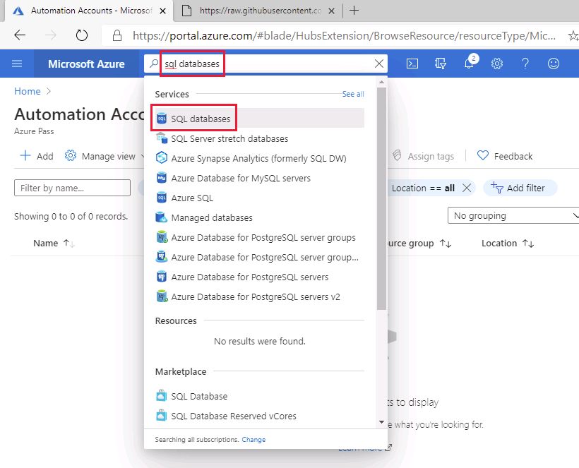
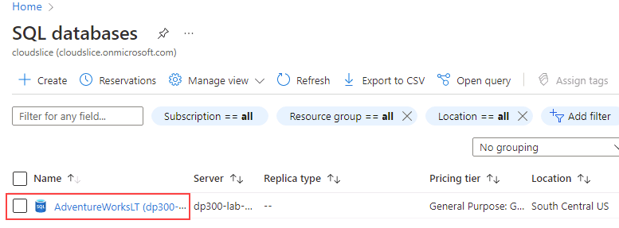
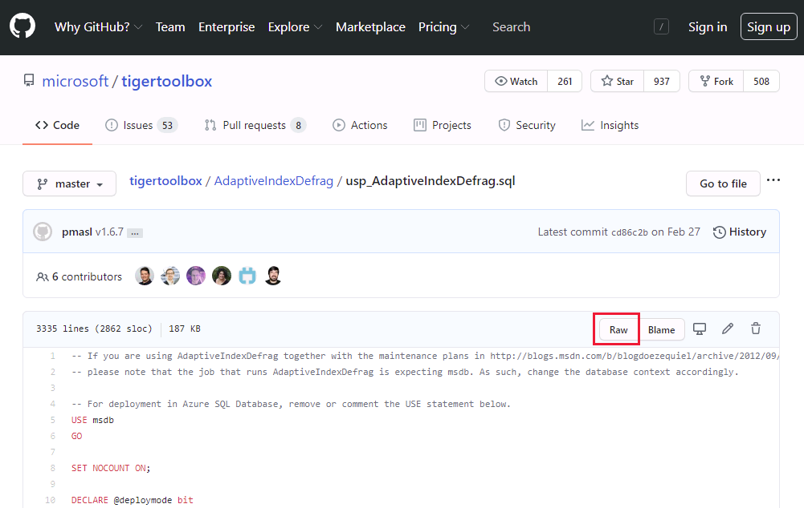

---
lab:
  title: 랩 13 - Automation Runbook을 배포하여 자동으로 인덱스 다시 빌드
  module: Automate database tasks for Azure SQL
---

# Automation Runbook을 배포하여 자동으로 인덱스 다시 빌드

**예상 시간:** 30분

데이터베이스 관리의 일상적인 업무를 자동화하는 데 도움을 주는 선임 데이터베이스 관리자로 고용되었습니다. 이 자동화에서는 AdventureWorks용 데이터베이스가 최고 성능으로 계속 작동하고 특정 조건에 따라 경고하는 메서드를 제공하도록 지원합니다. AdventureWorks는 IaaS(Infrastructure as a Service) 및 PaaS(Platform as a Service) 제품 모두에서 SQL Server를 활용합니다.

**참고:** 이러한 연습에서는 T-SQL 코드를 복사하여 붙여넣고 기존 SQL 리소스를 사용하도록 요청할 수 있습니다. 코드를 실행하기 전에 코드를 올바르게 복사했는지 확인하세요.

## Automation 계정 생성

1. 랩 가상 머신에서 브라우저 세션을 시작하고 [https://portal.azure.com](https://portal.azure.com/)으로 이동합니다. 이 랩 가상 머신의 **리소스** 탭에 제공된 Azure **사용자 이름** 및 **암호**를 사용하여 포털에 연결합니다.

    

1. 검색 표시줄의 Azure Portal에서 *automation*을 입력하고 검색 결과에서 **Automation 계정**을 선택한 다음, **+ 만들기**를 선택합니다.

    

1. **Automation 계정** 페이지에서 아래 정보를 입력한 다음 **검토 + 만들기**를 선택합니다.

    - **리소스 그룹:** &lt;리소스 그룹&gt;
    - **이름:** autoAccount
    - **위치:** 기본값 사용

    

1. 검토 페이지에서 만들기**를 선택합니다**.

    

    > [!NOTE]
    > Automation 계정은 약 3분 내에 만들어야 합니다.

## 기존 Azure SQL Database에 연결

1. Azure Portal에서 **sql 데이터베이스**를 검색하여 데이터베이스로 이동합니다.

    

1. SQL 데이터베이스 **AdventureWorksLT**를 선택합니다.

    

1. SQL Database 페이지의 주 섹션에서 **쿼리 편집기(미리 보기)** 를 선택합니다.

    

1. 데이터베이스에 로그인하려면 자격 증명을 입력하라는 메시지가 표시됩니다. 이 자격 증명을 사용합니다.

    - **로그인:** sqladmin
    - **암호:** P@ssw0rd01

1. 다음과 같은 오류 메시지가 표시됩니다.

    

1. 위에 표시된 오류 메시지의 끝에 제공된 **허용 목록 IP ...** 링크를 선택합니다. 그러면 SQL Database의 방화벽 규칙 항목으로 클라이언트 IP가 자동으로 추가됩니다.

    

1. 쿼리 편집기로 돌아가서 **확인**을 선택하여 데이터베이스에 로그인합니다.

1. 브라우저에서 새 탭을 열고 GitHub 페이지로 이동하여 [**AdaptativeIndexDefragmentation**](https://github.com/microsoft/tigertoolbox/blob/master/AdaptiveIndexDefrag/usp_AdaptiveIndexDefrag.sql) 스크립트에 액세스합니다. 그런 다음 **원시**를 선택합니다.

    

    그러면 복사할 수 있는 형식으로 코드를 제공합니다. 모든 텍스트(<kbd>CTRL</kbd> + <kbd>A</kbd>)를 선택하고 클립보드로 복사합니다(<kbd>CTRL</kbd> + <kbd>C</kbd>).

    >[!NOTE]
    > 이 스크립트의 목적은 하나 이상의 데이터베이스에 대해 하나 이상의 인덱스 및 필요한 통계 업데이트의 지능형 조각 모음을 수행하는 것입니다.

1. GitHub 브라우저 탭을 닫고 Azure Portal로 돌아갑니다.

1. 복사한 텍스트를 **쿼리 1** 창에 붙여넣습니다.

    

1. 쿼리의 5행과 6행에서 `USE msdb` 및 `GO`를 삭제한 다음(스크린샷에 강조 표시됨) **실행**을 선택합니다.

1. **저장 프로시저** 폴더를 펼쳐 생성된 항목을 확인합니다.

    

## Automation 계정 자산 구성

다음 단계는 Runbook 만들기를 준비하는 데 필요한 자산을 구성하는 것으로 진행됩니다. 그런 다음 **Automation 계정**을 선택합니다.

1. Azure Portal의 위쪽 검색 상자에 **automation**을 입력합니다.

    

1. 생성된 Automation 계정을 선택합니다.

    

1. Automation 블레이드의 **공유 리소스** 섹션에서 **모듈**을 선택합니다. 그런 다음 **갤러리 찾아보기**를 선택합니다.

    

1. 갤러리에서 **sqlserver**를 검색합니다.

    

1. 다음 화면으로 연결되는 **SqlServer**를 선택한 다음 **선택**을 선택합니다.

    

1. **모듈 추가** 페이지에서 사용 가능한 최신 런타임 버전을 선택한 다음, **가져오기**를 선택합니다. 그러면 PowerShell 모듈을 Automation 계정으로 가져옵니다.

    

1. 데이터베이스에 안전하게 로그인하려면 자격 증명을 만들어야 합니다. Automation 계정의 블레이드에서 **공유 리소스** 섹션으로 이동하여 **자격 증명**을 선택합니다.

    

1. **+ 자격 증명 추가**를 선택하고 아래 정보를 입력한 다음, **만들기**를 선택합니다.

    - 이름: **SQLUser**
    - 사용자 이름: **sqladmin**
    - 암호: **P@ssw0rd01**
    - 암호 확인: **P@ssw0rd01**

    

## PowerShell Runbook 생성

1. Azure Portal에서 **sql 데이터베이스**를 검색하여 데이터베이스로 이동합니다.

    

1. SQL 데이터베이스 **AdventureWorksLT**를 선택합니다.

    

1. **개요** 페이지에서 아래와 같이 Azure SQL Database의 **서버 이름**을 복사합니다(서버 이름은 *dp300-lab*으로 시작해야 함). 이후 단계에서 이 이름을 붙여넣습니다.

    

1. Azure Portal의 위쪽 검색 상자에 **automation**을 입력합니다.

    

1. 생성된 Automation 계정을 선택합니다.

    

1. Automation 계정 블레이드의 **프로세스 자동화** 섹션으로 스크롤하여 **Runbooks**를 선택한 다음, **+ Runbook 만들기**를 선택합니다.

    

    >[!NOTE]
    > 지금까지 학습한 바와 같이 두 개의 기존 Runbook이 만들어집니다. 이러한 Runbook은 자동화 계정 배포 중에 자동으로 만들어집니다.

1. Runbook 이름을 **IndexMaintenance**로 입력하고 runbook 유형은 **PowerShell**로 입력합니다. 사용 가능한 최신 런타임 버전을 선택한 다음, **, 만들기**를 선택합니다.

    

1. Runbook이 만들어지면 아래 Powershell 코드 조각을 복사하여 Runbook 편집기에 붙여넣습니다. 스크립트의 첫 번째 줄에 위의 단계에서 복사한 서버 이름을 붙여넣습니다. **저장**을 선택하고 **게시**를 선택합니다.

    **참고:** Runbook을 저장하기 전에 코드가 올바르게 복사되었는지 확인하세요.

    ```powershell
    $AzureSQLServerName = ''
    $DatabaseName = 'AdventureWorksLT'
    
    $Cred = Get-AutomationPSCredential -Name "SQLUser"
    $SQLOutput = $(Invoke-Sqlcmd -ServerInstance $AzureSQLServerName -UserName $Cred.UserName -Password $Cred.GetNetworkCredential().Password -Database $DatabaseName -Query "EXEC dbo.usp_AdaptiveIndexDefrag" -Verbose) 4>&1

    Write-Output $SQLOutput
    ```

    

1. 모든 것이 잘 진행되면 성공적인 메시지를 받게 됩니다.

    

## Runbook의 일정 생성

다음으로 runbook이 정기적으로 실행되도록 예약합니다.

1. **IndexMaintenance** Runbook의 왼쪽 탐색에 있는 **리소스**에서 **일정**을 선택합니다. 그런 다음 **+ 일정 추가**를 선택합니다.

    

1. **Runbook에 일정 연결**을 선택합니다.

    

1. **+ 일정 추가**를 선택합니다.

    

1. 원하는 경우 설명적 일정 이름과 설명을 제공합니다.

1. 다음 날의 시작 시간을 **태평양 표준시** 시간대의 **오전 4:00**로 지정합니다. **1**일마다 재발생하도록 구성합니다. 만료일을 설정하지 마세요.

    

1. **생성**를 선택하고 **확인**을 선택합니다.

1. 이제 일정이 만들어지고 Runbook에 연결됩니다. **확인**을 선택합니다.

    

Azure Automation은 Azure 및 Azure 이외의 환경에서 일관된 관리를 지원하는 클라우드 기반 자동화 및 구성 서비스를 제공합니다.

이 연습을 완료하면 매일 오전 4시에 실행되도록 SQL Server 데이터베이스에서 인덱스 조각 모음이 자동화됩니다.