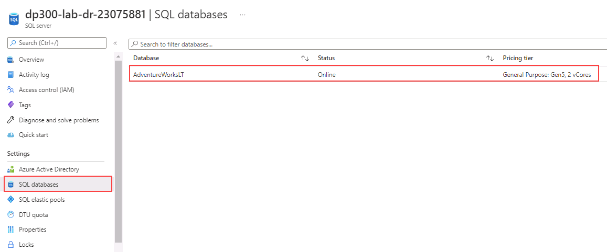

---
lab:
  title: 랩 14 - Azure SQL Database의 지역 복제 구성
  module: Plan and implement a high availability and disaster recovery solution
---

# Azure SQL Database의 지역 복제 구성

**예상 시간: 30분**

AdventureWorks 내의 DBA로서 Azure SQL Database의 지역 복제를 사용하도록 설정하고 제대로 작동하는지 확인해야 합니다. 또한 포털을 사용하여 수동으로 다른 지역으로 장애 조치합니다.

## 지역 복제 사용

1. 랩 가상 머신에서 브라우저 세션을 시작하고 [https://portal.azure.com](https://portal.azure.com/)으로 이동합니다. 이 랩 가상 머신의 **리소스** 탭에 제공된 Azure **사용자 이름** 및 **암호**를 사용하여 포털에 연결합니다.

    

1. Azure Portal에서 **sql 데이터베이스**를 검색하여 데이터베이스로 이동합니다.

    

1. SQL 데이터베이스 **AdventureWorksLT**를 선택합니다.

    

1. 데이터베이스 블레이드의 **데이터 관리** 섹션에서 **복제본**을 선택합니다.

    

1. **+ 복제본 만들기**를 선택합니다.

    

1. **SQL Database 만들기 - 지역 복제본** 페이지의 **서버**에서 **새로 만들기** 링크를 선택합니다.

    

    >[!NOTE]
    > 보조 데이터베이스를 호스트할 새 서버를 만들 때 위의 오류 메시지를 무시할 수 있습니다.

1. **SQL Database 서버 만들기** 페이지에서 기본 설정의 고유한 **서버 이름**, 유효한 **서버 관리자 로그인**, 보안 **암호**를 입력합니다. 대상 지역으로 **위치**를 선택한 다음, **확인**을 선택하여 서버를 만듭니다.

    

1. **SQL Database 만들기 - 지역 복제본** 페이지로 돌아가서 **검토 + 만들기**를 선택합니다.

    

1. **만들기**를 실행합니다.

    

1. 이제 보조 서버와 데이터베이스가 생성됩니다. 상태를 확인하려면 포털 상단의 알림 아이콘 아래를 봅니다. 

    

1. 성공하면 **배포 진행 중**에서 **배포 성공**으로 진행됩니다.

    

## SQL Database를 보조 지역으로 장애 조치(failover)

이제 Azure SQL Database 복제본이 만들어졌으므로 장애 조치(failover)를 수행합니다.

1. SQL 서버 페이지로 이동하여 목록에서 새 서버를 확인합니다. 보조 서버를 선택합니다(다른 서버 이름이 있을 수 있음).

    

1. SQL 서버 블레이드의 **설정** 섹션에서 **SQL 데이터베이스**를 선택합니다.

    

1. SQL 데이터베이스 기본 블레이드의 **데이터 관리** 섹션에서 **복제본**을 선택합니다.

    

1. 이제 지역 복제 링크가 설정되었습니다.

    

1. 보조 서버의 **...** 메뉴를 선택하고 **강제 장애 조치(failover)** 를 선택합니다.

    

    > [!NOTE]
    > 강제 장애 조치(failover)는 보조 데이터베이스를 주 역할로 전환합니다. 이 작업 중에는 모든 세션의 연결이 끊어집니다.

1. 경고 메시지가 표시되면 **예**를 클릭합니다.

    

1. 주 복제본의 상태는 **보류 중**으로 전환되고 보조 복제본의 상태는 **장애 조치(failover)** 로 전환됩니다. 

    

    > [!NOTE]
    > 이 프로세스는 몇 분 정도 걸릴 수 있습니다. 완료되면 역할이 전환되어 보조 서버는 새로운 주 서버가 되고 기존 주 서버는 보조 서버가 됩니다.

읽기 가능한 보조 데이터베이스는 주 데이터베이스와 동일한 Azure 지역에 있을 수 있고 더 일반적으로는 다른 지역에 있을 수도 있음을 확인했습니다. 이러한 종류의 읽기 가능한 보조 데이터베이스를 지역 보조 또는 지역 복제본이라고도 합니다.

지금까지 Azure SQL Database의 지역 복제본을 사용하도록 설정하고 포털을 사용하여 다른 지역에 수동으로 장애 조치(failover)하는 방법을 살펴보았습니다.
