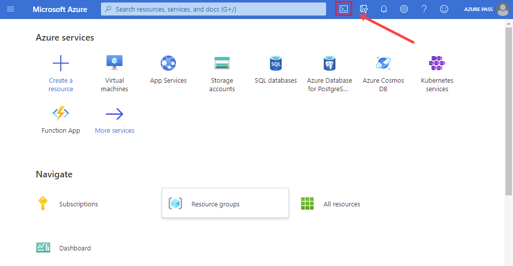
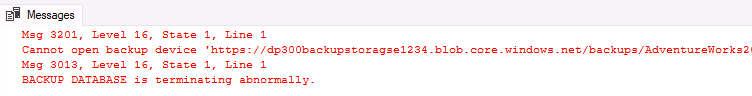
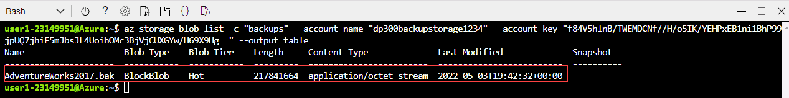

---
lab:
  title: 랩 15 - URL로 백업 및 URL에서 복원
  module: Plan and implement a high availability and disaster recovery solution
---

# URL로 백업

**예상 시간:** 30분

AdventureWorks의 DBA는 Azure의 URL에 데이터베이스를 백업하고 사용자 오류가 발생한 후 Azure Blob 스토리지에서 복원해야 합니다.

## 데이터베이스 복원

1. **https://github.com/MicrosoftLearning/dp-300-database-administrator/blob/master/Instructions/Templates/AdventureWorks2017.bak**에 있는 데이터베이스 백업 파일을 랩 가상 머신의 **C:\LabFiles\HADR** 경로에 다운로드합니다(폴더 구조가 없는 경우 새로 만들기).

    

1. Windows 시작 단추를 선택하고 SSMS를 입력합니다. 목록에서 **Microsoft SQL Server Management Studio 18**을 선택합니다.  

    

1. SSMS가 열리면 **서버에 연결** 대화 상자가 기본 인스턴스 이름으로 미리 채워집니다. **연결**을 선택합니다.

    

1. **데이터베이스** 폴더를 선택한 다음, **새 쿼리**를 선택합니다.

    

1. 새 쿼리 창에서 아래 T-SQL을 복사하여 붙여넣습니다. 쿼리를 실행하여 데이터베이스를 복원합니다.

    ```sql
    RESTORE DATABASE AdventureWorks2017
    FROM DISK = 'C:\LabFiles\HADR\AdventureWorks2017.bak'
    WITH RECOVERY,
          MOVE 'AdventureWorks2017' 
            TO 'C:\LabFiles\HADR\AdventureWorks2017.mdf',
          MOVE 'AdventureWorks2017_log'
            TO 'C:\LabFiles\HADR\AdventureWorks2017_log.ldf';
    ```

    **참고:** 데이터베이스 백업 파일 이름 및 경로는 1단계에서 다운로드한 것과 일치해야 합니다. 일치하지 않으면 명령이 실패합니다.

1. 복원이 완료되면 성공 메시지가 표시되어야 합니다.

    

## URL에 백업 구성

1. 랩 가상 머신에서 브라우저 세션을 시작하고 [https://portal.azure.com](https://portal.azure.com/)으로 이동합니다. 이 랩 가상 머신의 **리소스** 탭에 제공된 Azure **사용자 이름** 및 **암호**를 사용하여 포털에 연결합니다.

    

1. 아래 표시된 아이콘을 선택하여 **Cloud Shell** 프롬프트를 엽니다.

    

1. Cloud Shell를 사용한 적이 없는 경우 포털 아래쪽에 Azure Cloud Shell에 오신 것을 환영하는 메시지가 표시될 수 있습니다. **Bash**를 선택합니다.

    

1. Cloud Shell을 사용한 적이 없는 경우 스토리지를 구성해야 합니다. **고급 설정 표시**를 선택합니다(다른 구독이 할당되었을 수 있음).

    

1. 아래 대화 상자에 표시된 것처럼 기존 **리소스 그룹**을 사용하고 **스토리지 계정** 및 **파일 공유**의 새 이름을 지정합니다. **리소스 그룹** 이름을 적어 둡니다. *contoso-rg*로 시작해야 합니다. 그런 다음 **스토리지 만들기**를 선택합니다.

    **참고:** 스토리지 계정 이름은 고유해야 하며 특수 문자 없이 모두 소문자여야 합니다. 고유 이름을 제공하세요.

    

1. 완료되면 아래와 유사한 프롬프트가 표시됩니다. Cloud Shell 화면의 왼쪽 위에 **Bash**가 표시되는지 확인합니다.

    

1. Cloud Shell에서 다음 명령을 실행하여 CLI에서 새 스토리지 계정을 생성합니다. 위에서 적어 둔 **contoso-rg**로 시작하는 리소스 그룹 이름을 사용합니다.

    > [!NOTE]
    > 리소스 그룹 이름(**-g** 매개 변수)을 변경하고 고유한 스토리지 계정 이름(**-n** 매개 변수)을 제공합니다.

    ```bash
    az storage account create -n "dp300backupstorage1234" -g "contoso-rglod23149951" --kind StorageV2 -l eastus2
    ```

    

1. 다음으로 후속 단계에서 사용할 스토리지 계정의 키를 가져옵니다. 스토리지 계정 및 리소스 그룹의 고유 이름을 사용하여 Cloud Shell에서 다음 코드를 실행합니다.

    ```bash
    az storage account keys list -g contoso-rglod23149951 -n dp300backupstorage1234
    ```

    위 명령의 결과에 계정 키가 있습니다. 이전 명령에서 사용한 것과 동일한 이름(**-n** 뒤에 사용) 및 리소스 그룹(**-g** 뒤에 사용)을 사용해야 합니다. 다음과 같이 **key1**의 반환 값(큰따옴표 제외)을 복사합니다.

    

1. SQL Server 데이터베이스를 URL에 백업하는 경우 스토리지 계정 내의 컨테이너가 사용됩니다. 이 단계에서는 구체적으로 백업 스토리지용 컨테이너를 생성합니다. 이렇게 하려면 아래 명령을 실행합니다.

    ```bash
    az storage container create --name "backups" --account-name "dp300backupstorage1234" --account-key "storage_key" --fail-on-exist
    ```

    여기서 **dp300backupstorage1234**는 스토리지 계정을 만들 때 사용된 고유한 스토리지 계정 이름이고 **storage_key**는 위에서 생성된 키입니다. 출력에 **true**가 반환되어야 합니다.

    

1. 컨테이너 백업이 제대로 만들어졌는지 확인하려면 다음을 실행합니다.

    ```bash
    az storage container list --account-name "dp300backupstorage1234" --account-key "storage_key"
    ```

    여기서 **dp300backupstorage1234**는 스토리지 계정을 만들 때 사용된 고유한 스토리지 계정 이름이고 **storage_key**는 생성된 키입니다. 출력에 다음과 유사한 내용이 반환됩니다.

    

1. 보안을 위해 컨테이너 수준의 SAS(공유 액세스 서명)가 필요합니다. Cloud Shell 또는 PowerShell을 통해 작업을 수행할 수 있습니다. 다음을 실행합니다.

    ```bash
    az storage container generate-sas -n "backups" --account-name "dp300backupstorage1234" --account-key "storage_key" --permissions "rwdl" --expiry "date_in_the_future" -o tsv
    ```

    여기서 **dp300backupstorage1234**는 스토리지 계정을 만들 때 사용된 고유한 스토리지 계정 이름이고 **storage_key**는 생성된 키이며 **date_in_the_future**는 지금 이후의 시간입니다. **date_in_the_future**는 UT로 표시되어야 합니다. 예를 들어 **2021-12-31T00:00Z**는 2020년 12월 31일 자정에 만료되는 것을 나타냅니다.

    출력에 다음과 유사한 내용이 반환됩니다. 전체 공유 액세스 서명을 복사하여 **메모장**에 붙여넣으면 다음 작업에서 사용됩니다.

    

## 자격 증명 만들기

이제 기능이 구성되었으므로 Azure Storage 계정에서 백업 파일을 Blob으로 생성할 수 있습니다.

1. **SSMS(SQL Server Management Studio)** 를 시작합니다.

1. SQL Server에 연결하라는 메시지가 표시됩니다. **Windows 인증**이 선택되어 있는지 확인하고 **연결**을 선택합니다.

1. **새 쿼리**를 선택합니다.

1. 다음 Transact-SQL을 사용하여 클라우드의 스토리지에 액세스하는 데 사용할 자격 증명을 생성합니다. 적절한 값을 입력한 다음 **실행**을 선택합니다.

    ```sql
    IF NOT EXISTS  
    (SELECT * 
        FROM sys.credentials  
        WHERE name = 'https://<storage_account_name>.blob.core.windows.net/backups')  
    BEGIN
        CREATE CREDENTIAL [https://<storage_account_name>.blob.core.windows.net/backups]
        WITH IDENTITY = 'SHARED ACCESS SIGNATURE',
        SECRET = '<key_value>'
    END;
    GO  
    ```

    여기서 **<storage_account_name>** 의 두 항목은 만들어진 고유한 스토리지 계정 이름이고 **<key_value>** 는 이전 작업이 끝날 때 다음 형식으로 생성된 값입니다.

    `'se=2020-12-31T00%3A00Z&sp=rwdl&sv=2018-11-09&sr=csig=rnoGlveGql7ILhziyKYUPBq5ltGc/pzqOCNX5rrLdRQ%3D'`

1. 개체 탐색에서 **보안 -> 자격 증명**으로 이동하여 자격 증명 이 성공적으로 만들어졌는지 확인할 수 있습니다.

    

1. 자격 증명을 잘못 입력하여 다시 만들어야 하는 경우 다음 명령을 사용하여 자격 증명을 삭제할 수 있습니다. 스토리지 계정 이름을 변경해야 합니다.

    ```sql
    -- Only run this command if you need to go back and recreate the credential! 
    DROP CREDENTIAL [https://<storage_account_name>.blob.core.windows.net/backups]  
    ```

## URL로 백업

1. Transact-SQL로 다음 명령을 사용하여 **AdventureWorks2017** 데이터베이스를 Azure에 백업합니다.

    ```sql
    BACKUP DATABASE AdventureWorks2017   
    TO URL = 'https://<storage_account_name>.blob.core.windows.net/backups/AdventureWorks2017.bak';
    GO 
    ```

    여기서 **<storage_account_name>** 은 생성된 고유한 스토리지 계정 이름입니다. 출력에 다음과 유사한 내용이 반환됩니다.

    

    잘못 구성된 경우 다음과 유사한 오류 메시지가 표시됩니다.

    

    오류가 발생하면 자격 증명을 만드는 동안 잘못 입력한 것이 없는지, 모두 성공적으로 만들어졌는지 확인합니다.

## Azure CLI를 통해 백업 유효성 검사

파일이 실제로 Azure에 있는지 확인하려면 Storage Explorer(미리 보기) 또는 Azure Cloud Shell을 사용합니다.

1. 브라우저 세션을 시작하고 [https://portal.azure.com](https://portal.azure.com/)으로 이동합니다. 이 랩 가상 머신의 **리소스** 탭에 제공된 Azure **사용자 이름** 및 **암호**를 사용하여 포털에 연결합니다.

1. Azure Cloud Shell을 사용하여 다음 Azure CLI 명령을 실행합니다.

    ```bash
    az storage blob list -c "backups" --account-name "dp300backupstorage1234" --account-key "storage_key" --output table
    ```

    이전 명령에서 사용한 것과 동일한 고유한 스토리지 계정 이름(**--account-name** 뒤) 및 계정 키(**--account-key** 뒤)를 사용해야 합니다.

    

    백업 파일이 성공적으로 생성되었는지 확인할 수 있습니다.

## Storage Explorer를 통해 백업 유효성 검사

1. Storage Explorer(미리 보기)를 사용하려면 Azure Portal의 홈페이지에서 **스토리지 계정**을 선택합니다.

    

1. 백업의 생성된 고유한 스토리지 계정 이름을 선택합니다.

1. 왼쪽 탐색에서 **스토리지 브라우저(미리 보기)** 를 선택합니다. **BLOB 컨테이너** 확장

    

1. **백업**을 선택합니다.

    

1. 백업 파일은 컨테이너에 저장됩니다.

    

## URL에서 복원

이 작업은 Azure Blob 스토리지에서 데이터베이스를 복원하는 방법을 보여 줍니다.

1. **SSMS(SQL Server Management Studio)** 에서 **새 쿼리**를 선택한 다음, 다음 쿼리를 붙여넣고 실행합니다.

    ```sql
    USE AdventureWorks2017;
    GO
    SELECT * FROM Person.Address WHERE AddressId = 1;
    GO
    ```

    

1. 다음 명령을 실행하여 해당 고객의 이름을 변경합니다.

    ```sql
    UPDATE Person.Address
    SET AddressLine1 = 'This is a human error'
    WHERE AddressId = 1;
    GO
    ```

1. **1단계**를 다시 실행하여 주소가 변경되었는지 확인합니다. 이제 누군가가 WHERE 절을 사용하지 않거나 잘못된 WHERE 절을 사용하여 수천 또는 수백만 개의 행을 변경했다고 가정합니다. 해결 방법 중 하나는 마지막으로 사용 가능한 백업에서 데이터베이스를 복원하는 것입니다.

    

1. 데이터베이스를 복원하여 고객 이름이 실수로 변경되기 전의 상태로 되돌리려면 다음을 실행합니다.

    **참고:** **SET SINGLE_USER WITH ROLLBACK IMMEDIATE** 구문을 사용하면 열려 있는 트랜잭션이 모두 롤백됩니다. 이렇게 하면 활성 연결로 인해 복원이 실패하는 것을 방지할 수 있습니다.

    ```sql
    USE [master]
    GO

    ALTER DATABASE AdventureWorks2017 SET SINGLE_USER WITH ROLLBACK IMMEDIATE
    GO

    RESTORE DATABASE AdventureWorks2017 
    FROM URL = 'https://<storage_account_name>.blob.core.windows.net/backups/AdventureWorks2017.bak'
    GO

    ALTER DATABASE AdventureWorks2017 SET MULTI_USER
    GO
    ```

    여기서 **<storage_account_name>** 은 생성된 고유한 스토리지 계정 이름입니다.

    출력은 다음과 유사합니다.

    

1. **1단계**를 다시 실행하여 고객 이름이 복원되었는지 확인합니다.

    

Azure Blob 스토리지 서비스에서 백업을 수행하거나 복원하려면 구성 요소 및 상호 작용을 이해하는 것이 중요합니다.

이제 Azure의 URL에 데이터베이스를 백업하고 필요한 경우 복원할 수 있음을 확인했습니다.
